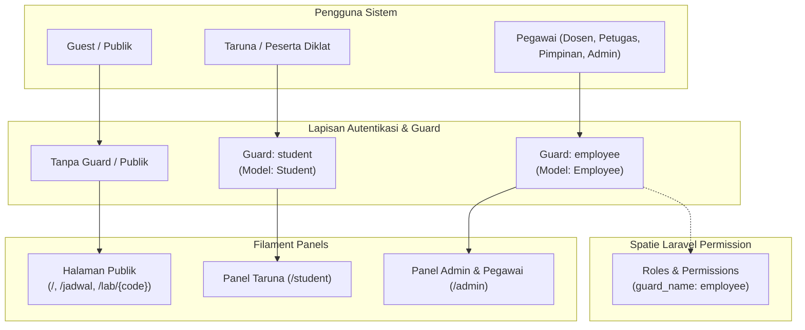
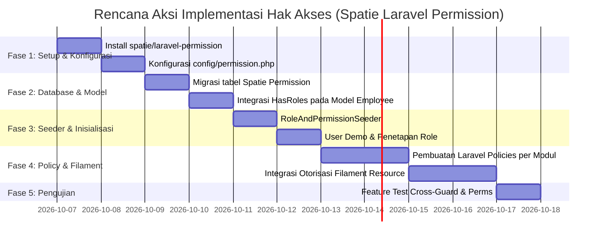

# Pembagian Hak Akses & Matriks Otorisasi Spatie Laravel Permission
## Sistem Informasi Layanan Terpadu STIP Jakarta (SILT-STIP)

Dokumen ini merupakan panduan spesifikasi dan rencana implementasi hak akses (Role & Permission) menggunakan paket `spatie/laravel-permission` pada basis kode `app-stip`, merujuk langsung pada ketentuan [PRD_STIP_Terpadu.md](file:///c:/laragon/www/app-stip/PRD_STIP_Terpadu.md) (§2 Aktor & Hak Akses, §7 Alur Status, §9 Model Data, §10 Teknis dan Non-Fungsional).

---

## 1. Arsitektur Multi-Guard & Prinsip Otorisasi

Sistem mengadopsi arsitektur **dua guard terpisah** dengan dua panel Filament independen:



### 1.1 Penjelasan Guard
1. **Guard `employee` (Panel `/admin`)**:
   - Model otentikasi: `App\Models\Core\Employee`.
   - Menggunakan trait `Spatie\Permission\Traits\HasRoles`.
   - Mengelola 5 peran utama: `admin`, `leader`, `officer`, `unit_admin`, dan `teacher`.
   - Seluruh tabel Spatie (`roles`, `permissions`, `model_has_roles`, dsb.) terikat pada `guard_name = 'employee'`.
2. **Guard `student` (Panel `/student`)**:
   - Model otentikasi: `App\Models\Core\Student`.
   - **Tidak menggunakan peran Spatie**. Taruna berinteraksi dalam kapasitas individu sebagai pemohon praktikum mandiri (CBT/ERCS) dan peminjam buku perpustakaan. Akses dibatasi pada data miliknya sendiri melalui filter kepemilikan (`borrower_id` dan `requester_id`).
3. **Guest / Publik**:
   - Tanpa login. Hanya dapat melihat kalender ketersediaan lab dan katalog lab tanpa membuka identitas peminjam atau data privat.

---

## 2. Definisi Peran (Roles) pada Guard `employee`

| Role Code | Nama Peran | Deskripsi & Lingkup Kewenangan | Prinsip Segregasi Tugas (SoD) |
|---|---|---|---|
| `admin` | Administrator Sistem | Mengelola master unit, ruangan, akun pegawai & taruna, template dokumen, setting aplikasi, role & permission, serta audit log. | **Dilarang** memverifikasi atau menyetujui transaksi operasional lab/BMN/rumah dinas. Hanya dapat menugaskan ulang tiket macet. |
| `leader` | Pimpinan Institusi / Unit | Memantau dashboard eksekutif, indikator KPI, dan laporan seluruh modul. Memiliki kewenangan approval akhir spesifik jabatan. | **Kepala Unit SPP**: `lab.booking.approve`<br>**Ketua STIP**: `residence.permit.approve`<br>Pimpinan BMN/Perpus: Read-only monitoring. |
| `officer` | Petugas Operasional | Petugas garda depan yang memproses transaksi harian: staf SPP (lab), staf BMN/Rumah Tangga, dan staf Perpustakaan. | Satu peran tunggal dengan **izin (permissions) terpartisi per bidang**. Staf lab tidak memproses BMN; staf BMN tidak memproses sirkulasi buku. |
| `unit_admin` | Admin Unit Kerja / Pengusul | Staf perwakilan dari unit kerja/prodi pengusul kebutuhan BMN dan rumah dinas. | Terisolasi ketat oleh **Scope Unit** (`unit_id`). Hanya dapat melihat dan mengajukan data untuk unit kerjanya sendiri. |
| `teacher` | Dosen | Tenaga pendidik yang mengampu mata kuliah, penanggung jawab sesi praktikum lab, dan anggota perpustakaan (kuota pinjam 5 buku). | Mengajukan booking lab, menjadi dosen penanggung jawab (`responsible_lecturer_id`), mencatat realisasi sesi lab yang diampu. Dapat merangkap `unit_admin`. |

---

## 3. Kamus Izin (Permission Dictionary)

Format standar: `<modul>.<entitas/fungsi>.<aksi>` dengan `guard_name = 'employee'`.

### 3.1 Modul Core & Administrasi Sistem (`core.*`)
- `core.employee.view` : Melihat data pegawai
- `core.employee.create` : Mendaftarkan pegawai baru
- `core.employee.update` : Memperbarui data pegawai
- `core.employee.delete` : Menonaktifkan akun pegawai
- `core.student.view` : Melihat data taruna
- `core.student.create` : Menambah taruna baru / impor batch
- `core.student.update` : Memperbarui data taruna
- `core.student.delete` : Menonaktifkan akun taruna
- `core.role.manage` : Mengelola role, permission, dan penugasan akses
- `core.unit.view` : Melihat master unit kerja / program studi
- `core.unit.manage` : Tambah, edit, nonaktifkan unit kerja
- `core.room.view` : Melihat daftar seluruh ruangan dan fasilitas
- `core.room.manage` : Tambah, edit, nonaktifkan ruangan
- `core.template.manage` : Kelola template cetak dokumen dinamis
- `core.setting.manage` : Kelola konfigurasi sistem (kuota, denda, SLA, jam operasional)
- `core.audit.view` : Melihat audit trail perubahan data

### 3.2 Modul A: Lab / Simulator SPP (`lab.*`)
- `lab.schedule.view` : Melihat jadwal detail lab dan ketersediaan slot
- `lab.booking.view-all` : Melihat seluruh data booking lab di semua program studi
- `lab.booking.view-own` : Melihat booking yang diajukan sendiri atau di mana dirinya menjadi dosen PJ
- `lab.booking.create` : Mengajukan permohonan booking lab baru
- `lab.booking.create-on-behalf` : Mengajukan booking atas nama dosen/kegiatan institusi lain
- `lab.booking.update` : Mengubah permohonan booking (dalam status draft atau diminta revisi)
- `lab.booking.cancel` : Membatalkan booking lab
- `lab.booking.verify` : **Verifikasi Tahap 1** oleh Petugas SPP (kesiapan alat, kit, kapasitas, relevansi IMO)
- `lab.booking.approve` : **Persetujuan Tahap 2** oleh Kepala Unit Sarana Praktik Pelaut
- `lab.booking.realize` : Mencatat realisasi sesi (peserta aktual, kondisi fasilitas, catatan insiden)
- `lab.curriculum.manage` : Mengelola mata kuliah, IMO Model Course, dan pemetaan kompetensi STCW
- `lab.material.manage` : Mengelola data bahan habis pakai, modul, alat, dan kit praktikum
- `lab.blackout.manage` : Mengatur tanggal penutupan lab (pemeliharaan, cuti bersama, UKP)
- `lab.document.print` : Mencetak lembar konfirmasi booking lab terverifikasi
- `lab.report.view` : Mengakses dashboard analitik dan ekspor laporan utilisasi (REKAP xlsx/pdf)

### 3.3 Modul B: BMN (`bmn.*`)
- `bmn.item.view-all` : Melihat seluruh rekapitulasi inventaris BMN institusi
- `bmn.item.view-unit` : Melihat inventaris BMN terbatas pada unit kerja sendiri
- `bmn.item.manage` : Mengelola data induk BMN (registrasi NUP, kode barang, spesifikasi)
- `bmn.submission.view-all` : Melihat semua daftar permohonan BMN baru
- `bmn.submission.view-unit` : Melihat permohonan BMN baru unit sendiri
- `bmn.submission.create` : Mengajukan permohonan pengadaan/penetapan BMN baru
- `bmn.submission.process` : **Memeriksa & memverifikasi** pengajuan BMN baru oleh Petugas BMN
- `bmn.return.view-all` : Melihat seluruh permohonan pengembalian BMN
- `bmn.return.view-unit` : Melihat permohonan pengembalian BMN unit sendiri
- `bmn.return.create` : Mengajukan permohonan pengembalian BMN (termasuk barang rusak)
- `bmn.return.process` : **Memeriksa fisik & memvalidasi** pengembalian BMN oleh Petugas BMN
- `bmn.movement.view` : Melihat riwayat mutasi / perpindahan lokasi barang
- `bmn.document.print` : Mencetak dokumen penetapan BMN dan bukti tanda terima pengembalian
- `bmn.report.view` : Mengakses dashboard inventaris BMN dan mengekspor rekap mutasi/kerusakan

### 3.4 Modul C: Rumah Dinas (`residence.*`)
- `residence.master.manage` : Mengelola data fisik rumah dinas (nomor rumah, alamat, status)
- `residence.permit.view-all` : Melihat seluruh permohonan surat izin penghunian
- `residence.permit.view-unit` : Melihat permohonan surat izin yang diajukan unit sendiri
- `residence.permit.create` : Mengajukan permohonan surat izin penghuni atas nama pegawai
- `residence.permit.verify` : **Memeriksa berkas & kelayakan** oleh Petugas Rumah Tangga
- `residence.permit.approve` : **Persetujuan akhir** surat izin penghuni oleh **Ketua STIP**
- `residence.document.print` : Mencetak surat izin penghuni resmi yang telah disetujui
- `residence.report.view` : Melihat statistik dan rekapitulasi penghuni rumah dinas

### 3.5 Modul D: Perpustakaan (`library.*`)
- `library.book.view` : Melihat katalog koleksi buku perpustakaan
- `library.book.manage` : Menambah, memperbarui katalog buku, nomor rak, stok dan ISBN
- `library.circulation.view-all` : Melihat seluruh riwayat transaksi sirkulasi peminjaman buku
- `library.circulation.view-own` : Melihat data transaksi peminjaman milik sendiri
- `library.circulation.process` : **Memproses transaksi peminjaman & pengembalian di loket**, pengecekan denda
- `library.fine.confirm` : Mengonfirmasi pelunasan denda keterlambatan buku
- `library.report.view` : Melihat dashboard sirkulasi, buku terpopuler, denda, dan laporan bulanan

---

## 4. Matriks Akses Peran vs Izin (Role-Permission Matrix)

Keterangan Simbol:
- `V` : Diizinkan penuh
- `-` : Tidak diizinkan
- `[U]` : Dibatasi hanya untuk Unit Kerja pegawai (`unit_id`)
- `[O]` : Dibatasi hanya untuk data milik sendiri (`own / requester_id / responsible_lecturer_id`)
- `[*]` : Diberikan khusus pejabat terkait (**Kepala Unit SPP** untuk booking lab, **Ketua STIP** untuk rumah dinas)
- `[P]` : Diberikan kepada Petugas (`officer`) sesuai bidang penugasan (SPP / BMN / Perpus)

| Modul | Nama Permission | `admin` | `leader` | `officer` | `unit_admin` | `teacher` |
|---|---|:---:|:---:|:---:|:---:|:---:|
| **Core** | `core.employee.view` | V | V | V | V | V |
| | `core.employee.create` / `.update` / `.delete` | V | - | - | - | - |
| | `core.student.view` | V | V | V | V | V |
| | `core.student.create` / `.update` / `.delete` | V | - | - | - | - |
| | `core.role.manage` | V | - | - | - | - |
| | `core.unit.view` | V | V | V | V | V |
| | `core.unit.manage` | V | - | - | - | - |
| | `core.room.view` | V | V | V | V | V |
| | `core.room.manage` | V | - | [P] | - | - |
| | `core.template.manage` | V | - | - | - | - |
| | `core.setting.manage` | V | - | - | - | - |
| | `core.audit.view` | V | V | - | - | - |
| **Lab** | `lab.schedule.view` | V | V | V | V | V |
| | `lab.booking.view-all` | V | V | [P] | - | - |
| | `lab.booking.view-own` | V | - | - | - | [O] |
| | `lab.booking.create` | - | - | [P] | - | V |
| | `lab.booking.create-on-behalf` | - | - | [P] | - | - |
| | `lab.booking.update` / `cancel` | - | - | [P] | - | [O] |
| | `lab.booking.verify` (Tahap 1) | - | - | [P] | - | - |
| | `lab.booking.approve` (Tahap 2) | - | [*] | - | - | - |
| | `lab.booking.realize` | - | - | [P] | - | [O] |
| | `lab.curriculum.manage` | V | - | [P] | - | - |
| | `lab.material.manage` | V | - | [P] | - | - |
| | `lab.blackout.manage` | V | - | [P] | - | - |
| | `lab.document.print` | V | V | [P] | - | [O] |
| | `lab.report.view` | V | V | [P] | - | [O] |
| **BMN** | `bmn.item.view-all` | V | V | [P] | - | - |
| | `bmn.item.view-unit` | - | - | - | [U] | - |
| | `bmn.item.manage` | V | - | [P] | - | - |
| | `bmn.submission.view-all` | V | V | [P] | - | - |
| | `bmn.submission.view-unit` | - | - | - | [U] | - |
| | `bmn.submission.create` | - | - | [P] | [U] | - |
| | `bmn.submission.process` | - | - | [P] | - | - |
| | `bmn.return.view-all` | V | V | [P] | - | - |
| | `bmn.return.view-unit` | - | - | - | [U] | - |
| | `bmn.return.create` | - | - | [P] | [U] | - |
| | `bmn.return.process` | - | - | [P] | - | - |
| | `bmn.movement.view` | V | V | [P] | [U] | - |
| | `bmn.document.print` | V | - | [P] | [U] | - |
| | `bmn.report.view` | V | V | [P] | [U] | - |
| **Rumah Dinas** | `residence.master.manage` | V | - | [P] | - | - |
| | `residence.permit.view-all` | V | V | [P] | - | - |
| | `residence.permit.view-unit` | - | - | - | [U] | - |
| | `residence.permit.create` | - | - | [P] | [U] | - |
| | `residence.permit.verify` | - | - | [P] | - | - |
| | `residence.permit.approve` | - | [*] | - | - | - |
| | `residence.document.print` | V | - | [P] | [U] | - |
| | `residence.report.view` | V | V | [P] | [U] | - |
| **Perpustakaan** | `library.book.view` | V | V | V | V | V |
| | `library.book.manage` | V | - | [P] | - | - |
| | `library.circulation.view-all` | V | V | [P] | - | - |
| | `library.circulation.view-own` | - | - | - | - | [O] |
| | `library.circulation.process` | - | - | [P] | - | - |
| | `library.fine.confirm` | - | - | [P] | - | - |
| | `library.report.view` | V | V | [P] | - | - |

---

## 5. Implementasi Khusus & Aturan Bisnis

### 5.1 Penanganan Multi-Bidang pada Role `officer`
PRD §2.2 menetapkan bahwa petugas SPP, petugas BMN/Rumah Tangga, dan staf Perpustakaan disatukan ke dalam satu role Spatie: `officer`.
Untuk memisahkan tanggung jawab kerja tanpa membuat redundansi role:
1. **Model Pengelompokan**: Seluruh petugas memiliki role `officer`.
2. **Partisi Izin (Direct Permissions / Modular Sets)**:
   - *Petugas Lab / SPP* diberikan set izin: `lab.*`, `core.room.manage`.
   - *Petugas BMN & Rumah Tangga* diberikan set izin: `bmn.*`, `residence.*`.
   - *Petugas Perpustakaan* diberikan set izin: `library.*`.
3. Pada Filament Panel, menu resource dan tindakan hanya muncul bila pegawai memegang permission yang bersangkutan (`canViewAny`, `canCreate`, dll.).

### 5.2 Otorisasi Pejabat Tertentu pada Role `leader`
PRD §2.2 & §2.3 menetapkan:
- **Kepala Unit Sarana Praktik Pelaut (SPP)**: Menyetujui tahap 2 booking lab (`lab.booking.approve`).
- **Ketua STIP**: Menyetujui permohonan surat izin rumah dinas (`residence.permit.approve`).
- **Pimpinan Lain**: Hanya read-only dashboard & laporan.

**Strategi Implementasi:**
- Role `leader` secara default memiliki akses melihat seluruh modul dan laporan (`*.view-all`, `*.report.view`).
- Permission eksekutif `lab.booking.approve` dan `residence.permit.approve` di-assign langsung (**direct permission**) kepada akun pejabat bersangkutan berdasarkan NIP / jabatan (`position`), atau ditugaskan saat pelantikan.
- **Delegasi Pejabat Pelaksana Harian (Plh)** (PRD Q13): Ketika pejabat utama berhalangan hadir, Administrator Sistem dapat mendelegasikan permission approve kepada pejabat pengganti dengan audit trail.

### 5.3 Isolasi Data Multi-Tenant Unit Kerja (`unit_admin`)
Admin Unit Kerja hanya boleh melihat dan mengelola data milik unit kerjanya sendiri.
Ditegakkan pada dua lapis pengamanan:
1. **Eloquent Global Scope / Query Scope**:
   ```php
   // Contoh pada Resource / Query
   if ($user->hasRole('unit_admin') && ! $user->hasRole('admin')) {
       $query->where('unit_id', $user->unit_id);
   }
   ```
2. **Laravel Model Policy**:
   ```php
   public function view(Employee $user, BmnSubmission $submission): bool
   {
       if ($user->can('bmn.submission.view-all')) {
           return true;
       }
       return $user->can('bmn.submission.view-unit') && $submission->unit_id === $user->unit_id;
   }
   ```

---

## 6. Rencana Aksi Implementasi Teknis (Step-by-Step Action Plan)



### Langkah 1: Instalasi Paket Spatie
Jalankan instalasi paket melalui Composer menggunakan PHP 8.4 Laragon:
```powershell
& "C:\laragon\bin\php\php-8.4.26-Win32-vs17-x64\php.exe" "C:\laragon\bin\composer\composer.phar" require spatie/laravel-permission
```

### Langkah 2: Publikasi Konfigurasi & Migrasi
Publikasikan aset konfigurasi Spatie:
```powershell
& "C:\laragon\bin\php\php-8.4.26-Win32-vs17-x64\php.exe" artisan vendor:publish --provider="Spatie\Permission\PermissionServiceProvider"
```

Sesuaikan berkas `config/permission.php`:
- Pastikan `models.permission` dan `models.role` menggunakan bawaan Spatie.
- Pastikan `default_guard` bernilai `'employee'`.
- Pastikan `display_permission_in_exception` bernilai `true` saat lokal/staging untuk mempermudah debugging.

### Langkah 3: Integrasi Trait `HasRoles` pada Model `Employee`
Buka [app/Models/Core/Employee.php](file:///c:/laragon/www/app-stip/app/Models/Core/Employee.php):
- Tambahkan `use Spatie\Permission\Traits\HasRoles;`
- Cantumkan trait `HasRoles` di dalam class declaration:
  ```php
  use HasFactory, Notifiable, HasRoles;
  
  protected string $guard_name = 'employee';
  ```

### Langkah 4: Eksekusi Migrasi Database
Jalankan migrasi tabel Spatie:
```powershell
& "C:\laragon\bin\php\php-8.4.26-Win32-vs17-x64\php.exe" artisan migrate
```
Tabel yang akan dibuat:
- `roles`
- `permissions`
- `model_has_roles`
- `model_has_permissions`
- `role_has_permissions`

### Langkah 5: Pembuatan `RoleAndPermissionSeeder`
Buat seeder `database/seeders/RoleAndPermissionSeeder.php` yang mendaftarkan seluruh role, permission, serta mapping default sebagaimana diatur pada tabel Bagian 4.

Struktur seeder meliputi:
1. Reset cache Spatie: `app()[\Spatie\Permission\PermissionRegistrar::class]->forgetCachedPermissions();`
2. Registrasi array permissions dengan `guard_name => 'employee'`.
3. Registrasi 5 roles: `admin`, `leader`, `officer`, `unit_admin`, `teacher`.
4. Sinkronisasi permissions ke masing-masing role (`syncPermissions()`).
5. Pembuatan akun pengujian awal untuk tiap persona:
   - `admin@stip.ac.id` (Role: `admin`)
   - `ketua@stip.ac.id` (Role: `leader` + direct permission `residence.permit.approve`)
   - `kepala.spp@stip.ac.id` (Role: `leader` + direct permission `lab.booking.approve`)
   - `petugas.lab@stip.ac.id` (Role: `officer` + bundle `lab.*`)
   - `petugas.bmn@stip.ac.id` (Role: `officer` + bundle `bmn.*` & `residence.*`)
   - `petugas.perpus@stip.ac.id` (Role: `officer` + bundle `library.*`)
   - `admin.unit.teknika@stip.ac.id` (Role: `unit_admin`, unit Teknika)
   - `dosen.nautika@stip.ac.id` (Role: `teacher`, unit Nautika)

### Langkah 6: Implementasi Laravel Policies & Penegakan SoD
Buat policy untuk setiap model:
- `BookingPolicy` : Mencegah status `draft`/`submitted` di-approve tanpa lewat `verified`; mencegah role `admin` mengeksekusi approve/verifikasi; membatasi dosen hanya melihat booking miliknya.
- `BmnSubmissionPolicy` & `BmnReturnPolicy` : Memvalidasi hak akses unit kerja (`unit_id`), membatasi aksi verifikasi hanya untuk `bmn.submission.process`.
- `ResidencePermitPolicy` : Memastikan Ketua STIP hanya bisa approve bila sudah berstatus `verified`.
- `CirculationPolicy` : Memastikan transaksi `returned` terkunci secara permanen dan hanya dapat diproses oleh pemegang izin `library.circulation.process`.

### Langkah 7: Pengkabelan Navigasi Filament Admin Panel
Setiap Filament Resource dikaitkan dengan Policy secara otomatis via Filament default authorization:
- `canViewAny()`
- `canCreate()`
- `canEdit()`
- `canDelete()`
Untuk aksi kustom di tabel/halaman detail (misal tombol "Verifikasi Booking", "Setujui Permohonan", "Proses Pengembalian"), sembunyikan tombol menggunakan pengecekan otorisasi:
```php
Action::make('verify')
    ->visible(fn ($record) => auth('employee')->user()->can('lab.booking.verify') && $record->status === 'submitted')
```

### Langkah 8: Pengujian Otomatis (Feature Tests)
Tulis pengujian feature pada `tests/Feature/AuthorizationTest.php`:
1. `test_admin_cannot_approve_lab_booking()` : Memastikan Admin ditolak saat mencoba approve booking.
2. `test_unit_admin_can_only_view_own_unit_bmn_items()` : Memastikan isolasi data antar unit kerja.
3. `test_student_cannot_access_admin_panel()` : Memastikan isolasi cross-guard.
4. `test_officer_without_bmn_permission_cannot_process_submission()` : Memastikan partisi peran petugas berjalan efektif.

---

## 7. Referensi Dokumen & File Terkait

- [PRD_STIP_Terpadu.md](file:///c:/laragon/www/app-stip/PRD_STIP_Terpadu.md) - Sumber utama persyaratan bisnis dan alur verifikasi.
- [config/auth.php](file:///c:/laragon/www/app-stip/config/auth.php) - Konfigurasi guard `employee` dan `student`.
- [app/Models/Core/Employee.php](file:///c:/laragon/www/app-stip/app/Models/Core/Employee.php) - Model autentikasi pegawai penerima trait Spatie `HasRoles`.
- [app/Providers/Filament/AdminPanelProvider.php](file:///c:/laragon/www/app-stip/app/Providers/Filament/AdminPanelProvider.php) - Konfigurasi panel pegawai (`guard: employee`).
- [app/Providers/Filament/StudentPanelProvider.php](file:///c:/laragon/www/app-stip/app/Providers/Filament/StudentPanelProvider.php) - Konfigurasi panel taruna (`guard: student`).
