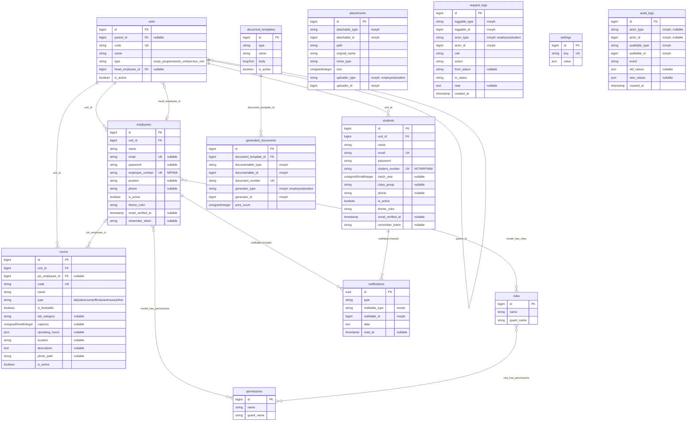
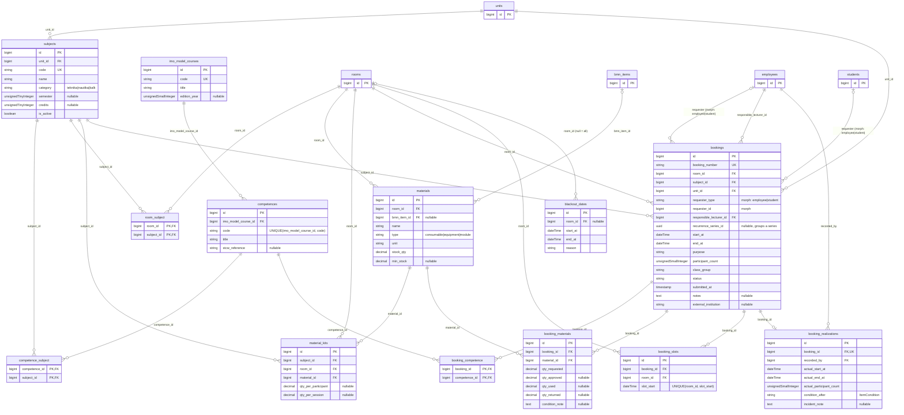
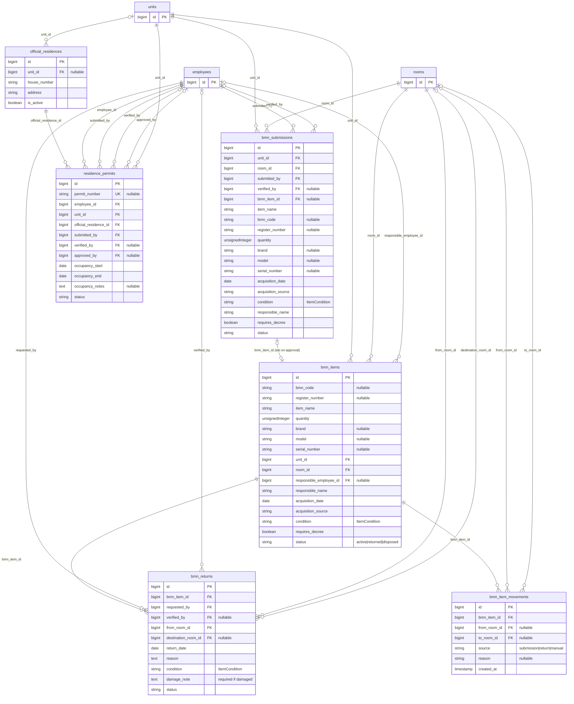
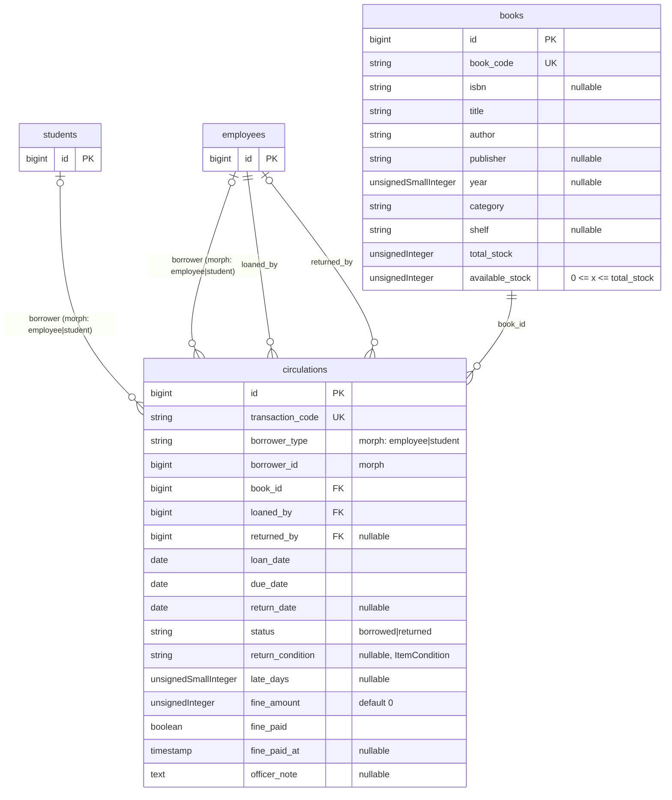

# PRD: Sistem Informasi Layanan Terpadu STIP Jakarta

| | |
|---|---|
| **Produk** | Sistem Informasi Layanan Terpadu STIP Jakarta (nama kerja: SILT-STIP `[TBD]`) |
| **Codebase** | `app-stip`: satu project Laravel, satu database |
| **Versi / Status** | 0.2, draft menunggu review |
| **Tanggal** | 6 Oktober 2026 |
| **Penyusun asal** | Fauzan Afif, S.Si. (Unit SPP) · Raidah Qodriah (BMN) · Staf Pengelola Perpustakaan |

> `[TBD]` = butuh keputusan. Semua dikumpulkan di bagian 12.

---

## 1. Ringkasan

STIP Jakarta membutuhkan **satu aplikasi** untuk empat layanan yang selama ini manual:

| Modul | Layanan |
|---|---|
| **A. Lab/Simulator SPP** | Booking lab, tanpa bentrok, terhubung ke mata kuliah dan IMO Model Course, dua tahap verifikasi |
| **B. BMN** | Inventaris per unit dan ruangan, pengajuan BMN baru, pengembalian BMN (termasuk rusak), dokumen penetapan |
| **C. Rumah Dinas** | Pengajuan surat izin penghuni, disetujui Ketua STIP |
| **D. Perpustakaan** | Data buku, anggota, peminjaman, pengembalian, denda |

Ketiga PRD asal punya pola sama (pengguna, unit/ruangan, pengajuan → verifikasi → persetujuan, dokumen cetak, laporan), sehingga disatukan: **satu data pegawai, satu data taruna, satu data unit/ruangan, satu alur status, satu mekanisme dokumen dan laporan.**

### Tujuan dan ukuran keberhasilan

| # | Tujuan | Ukuran |
|---|---|---|
| G1 | Satu akun per orang di semua modul | NIP (pegawai) dan NIT/NRP/NIM (taruna) unik, tanpa data ganda antar modul |
| G2 | Booking lab tanpa bentrok (first come, first served) | 0 booking tumpang tindih, ditegakkan di database |
| G3 | Booking lab terkait mata kuliah dan IMO Model Course | 100% booking disetujui punya mata kuliah + ≥1 kompetensi IMO |
| G4 | Semua perubahan inventaris BMN lewat verifikasi | 100% perubahan punya riwayat dan pemeriksa |
| G5 | Dokumen administrasi siap cetak otomatis | Konfirmasi booking, dokumen penetapan, bukti pengembalian, surat izin rumah dinas dapat dicetak dari aplikasi |
| G6 | Sirkulasi buku cepat | Pinjam/kembali < 1 menit, stok dan denda otomatis |
| G7 | Laporan tanpa olah manual | Laporan bulanan tiap modul < 1 menit |

### Non-goals (v1)

- Pembayaran online. Denda perpustakaan hanya dicatat lunas/belum.
- Manajemen aset penuh/penyusutan. Master resmi BMN tetap di sistem BMN/INVENTARIS AGB-SPP.
- Penyusunan jadwal kuliah (SIAKAD). Hanya sesi lab.
- Aplikasi mobile native (web responsif saja).
- Integrasi otomatis ke `spp-utilisasi` (v1: ekspor xlsx), peminjam eksternal/sewa lab, reservasi dan perpanjangan buku.

---

## 2. Aktor dan Hak Akses

### 2.1 Dua jenis akun, dua panel

| Panel Filament | Guard / Tabel | Siapa | Peran (Spatie) |
|---|---|---|---|
| `admin` (`/admin`) | `employee` / `employees` | Semua pegawai: dosen, petugas, pimpinan, Admin Unit Kerja, admin sistem | `teacher`, `officer`, `unit_admin`, `leader`, `admin` |
| `student` (`/student`) | `student` / `students` | Taruna / peserta diklat | tidak ada peran |
| Publik (`/`, `/jadwal`, `/lab/{code}`) | tanpa login | Guest | : |

- Tidak ada tabel `users` gabungan: atribut dan siklus hidup taruna dan pegawai berbeda.
- **Dosen = pegawai berperan `teacher`.** Satu pegawai boleh punya beberapa peran (mis. `teacher` + `unit_admin`).
- Izin per modul: `lab.*`, `bmn.*`, `residence.*`, `library.*`. Contoh: `lab.verify`, `lab.approve`, `residence.approve`.

### 2.2 Aktor hasil penyatuan

| Aktor | Berasal dari | Catatan |
|---|---|---|
| Guest | SPP | Hanya katalog lab dan kalender ketersediaan |
| Taruna | SPP Student + Perpus Anggota | Booking lab mandiri, pinjam buku |
| Dosen (`teacher`) | SPP Lecturer + Perpus Anggota | Penanggung jawab sesi lab, anggota perpustakaan (kuota lebih besar) |
| Admin Unit Kerja (`unit_admin`) | BMN | Hanya data unitnya |
| Petugas (`officer`) | Staf SPP + Petugas BMN/Rumah Tangga + Petugas Perpustakaan | Satu peran, dibatasi per modul lewat izin |
| Pimpinan (`leader`) | Kepala Unit Sarana Praktik Pelaut + Pimpinan BMN + Kepala Perpustakaan | Hanya lihat. **Kepala Unit Sarana Praktik Pelaut**: `lab.approve`. **Ketua STIP**: `residence.approve` |
| Admin Sistem (`admin`) | Admin SPP + Admin BMN | Kelola akun, peran, master, template, pengaturan. **Tidak** memverifikasi/menyetujui (pemisahan tugas) |

### 2.3 Matriks akses

✅ boleh · 🔸 hanya milik sendiri/unit sendiri · 👁 hanya lihat · ❌ tidak

| Kemampuan | Guest | Taruna | Dosen | Admin Unit | Petugas | Pimpinan | Admin |
|---|---|---|---|---|---|---|---|
| Kalender dan katalog lab (tanpa nama peminjam) | ✅ | ✅ | ✅ | ✅ | ✅ | ✅ | ✅ |
| **Lab:** ajukan/ubah/batalkan booking | ❌ | 🔸 `[TBD]`¹ | 🔸 | ❌ | ✅ (atas nama) | ❌ | ✅ |
| **Lab:** verifikasi tahap 1 (`lab.verify`) | ❌ | ❌ | ❌ | ❌ | ✅ | ❌ | ❌² |
| **Lab:** setujui/tolak tahap 2 (`lab.approve`) | ❌ | ❌ | ❌ | ❌ | ❌ | ✅ Kepala Unit SPP | ❌² |
| **Lab:** catat realisasi, kelola master lab | ❌ | ❌ | 🔸 realisasi | ❌ | ✅ | ❌ | ✅ |
| **BMN:** lihat inventaris | ❌ | ❌ | ❌ | 🔸 | ✅ | 👁 | ✅ |
| **BMN:** ajukan BMN baru / pengembalian | ❌ | ❌ | ❌ | 🔸 | ✅ | ❌ | ✅ |
| **BMN:** periksa/proses (`bmn.process`) | ❌ | ❌ | ❌ | ❌ | ✅ | ❌ | ❌² |
| **Rumah dinas:** ajukan surat izin | ❌ | ❌ | ❌ | 🔸 | ✅ | ❌ | ✅ |
| **Rumah dinas:** periksa (`residence.process`) | ❌ | ❌ | ❌ | ❌ | ✅ | ❌ | ❌² |
| **Rumah dinas:** setujui (`residence.approve`) | ❌ | ❌ | ❌ | ❌ | ❌ | ✅ Ketua STIP | ❌² |
| Cetak dokumen hasil aplikasi | ❌ | 🔸 | ❌ | 🔸 | ✅ | ❌ | ✅ |
| **Perpustakaan:** cari katalog | `[TBD]` | ✅ | ✅ | ❌ | ✅ | 👁 | ✅ |
| **Perpustakaan:** lihat pinjaman sendiri | ❌ | 🔸 | 🔸 | ❌ | ✅ | ❌ | ✅ |
| **Perpustakaan:** kelola buku, proses pinjam/kembali, denda | ❌ | ❌ | ❌ | ❌ | ✅ | ❌ | ❌² |
| Dashboard dan laporan | ❌ | ❌ | 🔸 | 🔸 | ✅ | 👁 | ✅ |
| Audit log | ❌ | ❌ | ❌ | ❌ | ❌ | 👁 | ✅ |
| Kelola akun, peran, master umum, pengaturan | ❌ | ❌ | ❌ | ❌ | ❌ | ❌ | ✅ |

¹ Taruna hanya booking praktik mandiri (ERCS/CBT), dosen dicantumkan sebagai penanggung jawab. Default sampai ada keputusan.
² Admin tidak memverifikasi, menyetujui, atau memproses transaksi. Admin hanya menugaskan ulang yang macet.

---

## 3. Modul A: Lab/Simulator SPP

### 3.1 Lab yang dapat dibooking (aktif)

| Kode | Nama | Kategori | IMO Model Course (indikatif)* |
|---|---|---|---|
| CHL | Cargo Handling Laboratory | Nautika (juga KALK) | 7.03 / 7.01, 1.10 |
| EEL | Electric and Electronic Laboratory | Teknika | 7.04, 7.08 |
| EWS | Engineering Workshop | Teknika | 7.04 |
| MEL | Marine Engineering Laboratory | Teknika | 7.04 / 7.02 |
| CBT | Computer Based Training 1 & 2 | Semua | tergantung modul (mis. 1.27, 3.17) |
| ERCS | Engine Room Certification Simulator | Teknika | 2.07, 7.04 / 7.02 |
| LTL | Language Training Laboratory | Semua | 3.17 |
| ACSL | Automatic Control System Laboratory | Teknika | 7.04, 7.08 |

\*Indikatif. Kaprodi/dosen memvalidasi pemetaan mata kuliah terhadap RPS sebelum go-live. BRF, LCHS, NAS, SOL, ERGL dinonaktifkan sejak Mei 2026. `LAI` (rooftop, selasar) bukan lab `[TBD]` apakah dapat dibooking.

### 3.2 Alur

1. Pemohon pilih lab → tanggal/jam (hanya slot kosong) → mata kuliah → kompetensi IMO (difilter menurut mata kuliah) → peserta → bahan.
2. Memilih mata kuliah memuat **kit bahan default**. Pemohon boleh mengubah. Kekurangan stok ditandai tetapi tidak memblokir.
3. **Petugas** memverifikasi (lab siap, bahan ada, kapasitas, relevansi mata kuliah) atau minta revisi/tolak.
4. **Kepala Unit Sarana Praktik Pelaut** menyetujui atau menolak. Tidak bisa bertindak sebelum Petugas memverifikasi.
5. Booking disetujui: konfirmasi PDF siap cetak. Pada hari sesi: check-in, check-out, catat realisasi.

### 3.3 Aturan penjadwalan (first come, first served)

1. **Tidak ada tumpang tindih** pada lab yang sama untuk booking berstatus penahan slot.
2. **FCFS:** pengajuan yang lebih dulu tersimpan di database mendapat slot. Yang bentrok ditolak dengan alternatif kosong.
3. **Ditegakkan di database:** waktu dipecah ke `booking_slots` (default 30 menit `[TBD]`), dengan `UNIQUE (room_id, slot_start)`. Baris dihapus saat booking melepas slot. Cek overlap + `SELECT … FOR UPDATE` saja ditolak karena satu jalur kode terlewat bisa merusaknya.
4. **Jam operasional** `[TBD]`: Senin–Jumat 07.30–16.00 WIB. Di luar itu perlu persetujuan dengan alasan.
5. **Blackout:** libur nasional/cuti bersama, pemeliharaan, hari UKP. **Kapasitas:** peserta ≤ kapasitas ruangan.
6. **Booking berulang:** dibuat sebagai seri, tiap kemunculan dicek, yang bentrok dilewati dan dilaporkan.
7. **Lead time** `[TBD]`: 3 hari kerja s.d. 60 hari sebelum sesi. **SLA** `[TBD]`: Petugas 1 hari kerja, Kepala Unit 1 hari kerja. Lewat tenggat: `expired`.
8. Tanpa prioritas override. Perubahan karena acara mendesak lewat persetujuan peminjam atau batal + booking ulang oleh Petugas dengan alasan.
9. Petugas dapat menandai lab "tidak operasional" untuk periode tertentu. Booking baru diblokir, yang ada ditandai.
10. **Mata kuliah tanpa kompetensi IMO tidak dapat dibooking.**

---

## 4. Modul B: BMN

### 4.1 Pengajuan BMN baru
1. Admin Unit Kerja memilih unit dan ruangan, mengisi data BMN, mengunggah dokumen pendukung.
2. Petugas BMN memeriksa. Kurang → `revision_requested`.
3. Setelah diverifikasi, data masuk rekap inventaris (`bmn_items`) dan tercatat di riwayat perpindahan.
4. BMN yang perlu dokumen penetapan (mis. laptop): aplikasi membuat dokumen siap cetak. Admin Unit Kerja dan Petugas dapat mencetak.

### 4.2 Pengembalian BMN (termasuk rusak)
1. Admin Unit Kerja memilih barang dari inventaris ruangannya, mengisi tanggal dan alasan, memilih kondisi.
2. **Jika rusak: keterangan dan foto wajib.**
3. Petugas memeriksa. Setelah diverifikasi, status dan lokasi barang di rekap diperbarui, dan bukti pengembalian dapat dicetak.

### 4.3 Aturan
- Admin Unit Kerja hanya mengajukan dan melihat data unitnya.
- Data masuk rekap hanya setelah diverifikasi Petugas BMN.
- Dokumen penetapan hanya dapat dicetak setelah data terverifikasi dan alur persetujuan terpenuhi `[TBD]` Q4.
- Riwayat pengajuan dan perubahan status tersimpan.
- Jumlah > 1 dan pengembalian sebagian `[TBD]` Q6.

---

## 5. Modul C: Surat Izin Rumah Dinas

**Alur:** unit pengusul (lewat Admin Unit Kerja) mengajukan atas nama pegawai → Petugas Rumah Tangga memeriksa kelengkapan (kurang → `revision_requested`) → **Ketua STIP menyetujui** → surat izin terbit siap cetak (dicetak Admin Unit Kerja atau Petugas).

**Aturan:**
- Pengajuan dari unit pengusul, bukan oleh penghuni langsung. Pegawai penghuni dicatat di `employees` tanpa login bila tidak perlu akses.
- Ketua STIP tidak bisa menyetujui sebelum Petugas memverifikasi. Surat **hanya terbit setelah Ketua STIP menyetujui**.
- Format surat mengikuti format resmi STIP `[TBD]` Q5.

---

## 6. Modul D: Perpustakaan

### 6.1 Peminjaman (di loket)
Petugas memilih peminjam (cari NIT/NRP/NIM/NIP/nama) dan buku (kode/judul). Sistem memvalidasi lalu menyimpan: tanggal pinjam hari ini, jatuh tempo +7 hari, stok tersedia −1.

### 6.2 Pengembalian
Petugas mencari transaksi aktif, mengecek kondisi (baik/rusak/hilang), lalu memproses. Sistem menghitung keterlambatan dan denda. Petugas mengonfirmasi denda lunas. Status `returned`, stok +1.

### 6.3 Aturan
| Aturan | Nilai (dapat diubah di `settings`) |
|---|---|
| Masa pinjam | 7 hari kalender |
| Kuota | 3 buku (taruna), 5 buku (dosen/pegawai), sekaligus |
| Denda | Rp 1.000 / hari / buku |
| Blokir | Peminjam dengan buku lewat jatuh tempo diblokir meminjam sampai mengembalikan |
| Stok | Pinjam diblokir bila `available_stock` = 0. `0 ≤ available_stock ≤ total_stock` |
| Kunci | Transaksi `returned` terkunci, tidak bisa diubah |
| Integritas | `book_code`, NIT/NRP/NIM unik. Buku yang sedang dipinjam tidak boleh dihapus |
| Hilang / rusak | Hilang: `total_stock` −1 tanpa tambah stok tersedia. Rusak: stok kembali `[TBD]` Q7 |

Data master anggota memakai tabel `students` dan `employees`, bukan tabel anggota terpisah.

---

## 7. Alur Status Terpadu dan Dokumen Cetak

### 7.1 Status

| Status | Arti |
|---|---|
| `draft` | Belum dikirim |
| `submitted` | Menunggu pemeriksaan |
| `revision_requested` | Dikembalikan ke pengaju, catatan wajib |
| `verified` | Lolos pemeriksaan Petugas, menunggu persetujuan akhir |
| `approved` | Disetujui |
| `in_use` / `completed` | Lab sedang dipakai / selesai (booking), atau data masuk inventaris / surat dicetak |
| `rejected`, `cancelled` | Ditolak (alasan wajib) / dibatalkan pengaju |
| `no_show`, `expired` | Booking: tidak check-in sampai T+30 menit / tidak diverifikasi sampai tenggat |

| Alur | Jalur |
|---|---|
| Booking lab | `draft → submitted → verified → approved → in_use → completed` |
| BMN baru, pengembalian BMN | `draft → submitted → (revision_requested) → approved → completed` (approved = verifikasi Petugas BMN) |
| Izin rumah dinas | `draft → submitted → (revision_requested) → verified → approved → completed` (approved = Ketua STIP) |
| Sirkulasi buku | `borrowed → returned`. Terlambat = turunan dari `due_date`, tidak disimpan |

Semua cabang dapat berakhir di `rejected`. **Status penahan slot booking:** `submitted`, `revision_requested` (sampai tenggat revisi), `verified`, `approved`, `in_use`, `completed`. Status `rejected`, `cancelled`, `expired`, `no_show` melepas slot segera.

Aturan umum: setiap perubahan status menulis satu baris `request_logs` (append-only). `reject` dan `request_revision` wajib catatan. Notifikasi in-app dan email pada tiap perubahan penting.

### 7.2 Dokumen cetak

Satu mekanisme (`document_templates` → `generated_documents`), nomor dokumen unik, jumlah cetak tercatat, isi dikunci setelah terbit.

| Dokumen | Modul | Syarat terbit |
|---|---|---|
| Konfirmasi booking | Lab | `approved` |
| Dokumen penetapan BMN | BMN | Data terverifikasi dan persetujuan terpenuhi |
| Bukti pengembalian BMN | BMN | Pengembalian terverifikasi |
| Surat izin rumah dinas | Rumah dinas | `approved` oleh Ketua STIP |
| Laporan | Semua | Sesuai hak akses (header + blok tanda tangan) |

---

## 8. Dashboard dan Laporan

Semua dapat difilter dan diekspor ke Excel dan PDF. Widget tampil sesuai peran dan izin modul.

| Modul | Dashboard | Laporan rutin |
|---|---|---|
| Lab | KPI booking, jadwal per lab (harian), per kategori Teknika/Nautika/KALK, mata kuliah teratas, utilisasi lab %, tren, cakupan IMO, SLA verifikasi, konsumsi bahan, rencana vs realisasi | Rekap harian/bulanan/tahunan per mata kuliah dan kategori. Ekspor xlsx kompatibel REKAP UTILISASI v3 `[TBD]`. PDF dengan tanda tangan Kepala Unit SPP |
| BMN | Total BMN, per unit dan ruangan, pengajuan menunggu pemeriksaan (baru dan pengembalian), barang rusak, dokumen perlu dicetak | Rekap inventaris per unit/ruangan, penambahan dan pengembalian (daftar rusak), riwayat perpindahan, rekap dokumen dicetak |
| Rumah dinas | Jumlah pengajuan dan statusnya | Rekap per periode dan status |
| Perpustakaan | Total koleksi (judul, stok), total anggota, dipinjam hari ini, jatuh tempo/terlambat, 5 buku terpopuler | Riwayat pinjam/kembali (filter tanggal), ketersediaan buku, rekap denda bulanan |

**Metrik lab** memakai kosakata REKAP UTILISASI: FR = sesi per hari (`completed`), JLH = peserta per hari (aktual), DRS = jam per hari (aktual), JF/JP = total bulanan. Utilisasi = jam terbooking ÷ jam operasional. Dashboard menandai angka *rencana* (`approved`) atau *realisasi* (`completed`).

---

## 9. Model Data (ER Diagram)

### 9.1 Kaidah penamaan Laravel

| Aturan | Contoh |
|---|---|
| Tabel: bahasa Inggris, `snake_case`, jamak | `employees`, `bookings`, `bmn_items` |
| Primary key `id`. `created_at`/`updated_at` di semua tabel (tidak digambar). Tabel append-only hanya `created_at` | |
| Foreign key `<model>_id`. Peran khusus memakai nama peran | `room_id`, `responsible_lecturer_id`, `verified_by` |
| Pivot: dua nama singular urut alfabet | `competence_subject`, `room_subject`, `booking_competence` |
| Polimorfik `<nama>_type` + `<nama>_id` | `requester_*`, `borrower_*`, `loggable_*`, `attachable_*` |
| Enum disimpan sebagai `string` dan di-cast ke PHP Enum, nilai Inggris `snake_case` | `good`, `minor_damage`, `major_damage`, `lost` |

**Enum:** `ItemCondition` (`good`, `minor_damage`, `major_damage`, `lost`) dipakai di semua modul · `RequestStatus` (§7.1) · `subjects.category` (`teknika`, `nautika`, `kalk`) · `units.type` (`study_program`, `work_unit`, `service_unit`) · `rooms.type` (`lab`, `classroom`, `office`, `warehouse`, `other`) · `materials.type` (`consumable`, `equipment`, `module`) · `circulations.status` (`borrowed`, `returned`).

### 9.2 Penyatuan entitas

| Dari PRD asal | Menjadi |
|---|---|
| Dosen/staf SPP, petugas BMN, petugas dan anggota dosen perpustakaan, pegawai penghuni rumah dinas | **`employees`** (+ peran) |
| Taruna SPP, anggota taruna perpustakaan | **`students`** |
| Prodi (SPP) dan unit kerja (BMN) | **`units`** (hierarki, `type`) |
| Lab (SPP) dan ruangan (BMN) | **`rooms`** (lab = `is_bookable = true`) |
| Kondisi barang/buku/lab di tiga PRD | Enum **`ItemCondition`** |
| Verifikasi booking dan riwayat pengajuan BMN | **`request_logs`** (polimorfik, append-only) |
| Lampiran booking dan dokumen pendukung BMN | **`attachments`** (polimorfik) |
| Aturan numerik (masa pinjam, kuota, denda, SLA, lead time) | **`settings`** |

Sengaja tidak digabung: `books`, `bmn_items`, `materials` (siklus hidup beda). `materials` bertipe alat dapat menautkan `bmn_item_id`.

### 9.3 Catatan kunci data

- **Guard:** kolom yang hanya diisi pegawai memakai FK ke `employees` (`verified_by`, `approved_by`, `loaned_by`, `responsible_lecturer_id`, ...). Kolom yang bisa diisi taruna atau pegawai bersifat polimorfik: pemohon booking, peminjam buku, pengunggah, pelaku log. Daftarkan `Relation::enforceMorphMap(['employee' => Employee::class, 'student' => Student::class])`.
- `booking_slots` UNIQUE (`room_id`, `slot_start`) adalah penegak anti-bentrok.
- `competences` UNIQUE (`imo_model_course_id`, `code`). Kaitan ke IMO lewat `imo_model_course_id`. Bila Q11 mengizinkan rujukan kurikulum nasional, kolom ini dijadikan nullable + kolom `source`, tanpa ganti nama tabel.
- `bmn_submissions` menampung pengajuan. `bmn_items` baru dibuat atau diubah saat pengajuan `approved` dan `bmn_item_movements` mencatat lokasinya.
- `bmn_returns.damage_note` dan foto wajib bila kondisi rusak (validasi aplikasi).
- `books`: `0 ≤ available_stock ≤ total_stock`. `circulations`: terkunci setelah `returned`.
- `bookings.recurrence_series_id` (uuid, tanpa FK) mengelompokkan seri berulang.
- Peran dan izin memakai tabel `spatie/laravel-permission` (`roles`, `permissions`, `model_has_roles`, `model_has_permissions`, `role_has_permissions`). Tidak digambar penuh.

### 9.4 Diagram

Diagram dibagi per modul. Kotak yang hanya berisi `id` adalah referensi ke tabel modul lain. Notasi: `||` satu wajib, `|o` nol atau satu, `o{` nol atau banyak.

**Inti: pegawai, taruna, unit, ruangan, lampiran, log, dokumen, otorisasi**

**Modul A: Lab/Simulator SPP**

**Modul B dan C: BMN dan Rumah Dinas**

**Modul D: Perpustakaan**

---

## 10. Teknis dan Non-Fungsional

| Lapisan | Pilihan |
|---|---|
| Bahasa / Framework | PHP 8.4 (Laragon `php-8.4.26`), Laravel 13 |
| UI | Filament 5, Livewire 4 + Alpine, Tailwind (Vite) |
| Database | MySQL 8.0 (`app-stip`) |
| Tes / gaya kode | PHPUnit 12 (Feature test per halaman), Laravel Pint |
| Queue / notifikasi | Queue `database`, notifikasi Laravel (mail + database) |
| Otorisasi | `spatie/laravel-permission` + Laravel Policy `[TBD]` Q1 |
| PDF | `barryvdh/laravel-dompdf` `[TBD]` Q2 |
| Ekspor Excel | Ekspor bawaan Filament atau `maatwebsite/excel` `[TBD]` Q3 |

**Struktur:** modular monolith. Namespace `App\Models\{Core,Lab,Bmn,Library}`, Policy dan Action per modul, Filament Cluster per modul (menu: Layanan Lab, BMN & Rumah Dinas, Perpustakaan, Master Data, Pengaturan). Zona waktu `Asia/Jakarta`, locale `id`. Transisi status di satu tempat (method model atau action class) dalam DB transaction yang juga menulis `booking_slots` dan `request_logs`.

**Autentikasi:** dua guard (`employee`, `student`), dua provider, dua broker reset kata sandi dengan tabel token terpisah (`employee_password_reset_tokens`, `student_password_reset_tokens`). `Employee::canAccessPanel()` hanya panel `admin`, `Student::canAccessPanel()` hanya panel `student`. Hindari session driver `database` (kolom `sessions.user_id` tidak membedakan guard), pakai `file` atau `redis`.

**Migrasi:**
- Tabel `users` bawaan diganti `employees` dan `students`. `student_a`/`student_b` → `students`, `Admin` → `employees` berperan `admin`. Enum `UserType` lama dihapus.
- `.env.example` masih `sqlite`, `.env` sudah `mysql`: samakan ke MySQL.
- `php` CLI di PATH 8.5.0, Laragon 8.4.26: jalankan artisan/composer dengan versi yang sama dengan Laragon.
- Seed: unit/prodi, ruangan (8 lab aktif), mata kuliah + pemetaan IMO, peran dan izin, template dokumen, `settings`. Impor awal: taruna, pegawai, buku, inventaris BMN (xlsx).

| Area | Kebutuhan |
|---|---|
| Konkurensi | Booking ganda mustahil walau serentak (constraint DB + feature test). Stok buku tidak negatif walau dua petugas bersamaan (transaction + row lock) |
| Performa | Kalender dan dashboard < 2 detik untuk 1 tahun data |
| Keamanan | CSRF, Policy di setiap aksi, rate-limit login, tanpa data pribadi peminjam di halaman publik, validasi unggahan (PDF/gambar ≤ 5 MB), akses BMN dibatasi per unit (global scope + Policy) |
| Audit | Log verifikasi tak dapat diubah, `audit_logs` untuk master dan transaksi |
| Ketersediaan | LAN/intranet kampus, backup MySQL harian, retensi data ≥ 5 tahun `[TBD]` |
| Kegunaan | UI Indonesia, responsif (taruna memakai ponsel), booking maks. 3 langkah, status dengan warna **dan** teks |

---

## 11. Kriteria Penerimaan (v1)

**Inti**
- [ ] Pegawai login di panel `admin`, taruna di panel `student`. Akun taruna tidak bisa membuka panel `admin` dan sebaliknya.
- [ ] NIP dan NIT/NRP/NIM tidak dapat ganda. Menu dan data tiap peran sesuai matriks §2.3.
- [ ] Admin Unit Kerja hanya melihat dan mengajukan data unitnya (diuji dengan dua unit).
- [ ] Semua perubahan status tercatat di `request_logs`. Reject/revisi tanpa catatan ditolak.

**Lab**
- [ ] Guest melihat kalender tanpa identitas peminjam.
- [ ] Pengajuan bentrok pada lab/waktu sama ditolak, termasuk dua permintaan serentak (test).
- [ ] Mata kuliah tanpa kompetensi IMO tidak dapat dipilih. Memilih mata kuliah mengisi kit bahan default.
- [ ] Kepala Unit Sarana Praktik Pelaut tidak dapat menyetujui sebelum Petugas memverifikasi.
- [ ] Booking `rejected`/`cancelled`/`expired`/`no_show` melepas slot segera.

**BMN dan Rumah Dinas**
- [ ] BMN baru masuk rekap hanya setelah diverifikasi Petugas BMN.
- [ ] Pengembalian barang rusak tanpa keterangan atau foto ditolak.
- [ ] Lokasi/status barang berubah setelah pengembalian diverifikasi dan tercatat di riwayat perpindahan.
- [ ] Surat izin rumah dinas tidak terbit sebelum Ketua STIP menyetujui, dan Ketua STIP tidak dapat menyetujui sebelum Petugas memverifikasi.
- [ ] Dokumen penetapan, bukti pengembalian, dan surat izin tidak dapat dicetak sebelum status yang disyaratkan.

**Perpustakaan**
- [ ] Peminjaman gagal bila stok 0, kuota terlampaui, atau ada tunggakan terlambat.
- [ ] Jatuh tempo otomatis +7 hari. Stok −1 saat pinjam, +1 saat kembali. Denda Rp 1.000/hari otomatis.
- [ ] Transaksi `returned` tidak dapat diubah. Buku yang sedang dipinjam tidak dapat dihapus.

**Laporan dan kualitas**
- [ ] Dashboard lab harian/bulanan/tahunan dapat difilter kategori dan mata kuliah, totalnya sama dengan hitungan SQL manual.
- [ ] Laporan Excel/PDF seluruh modul cocok dengan dashboard.
- [ ] Semua kode baru punya Feature test. `php artisan test` dan Pint lulus.

### Milestone (indikatif)

| Fase | Hasil |
|---|---|
| M0 | Sign-off PRD, pertanyaan terbuka ditutup, pemetaan mata kuliah ↔ IMO terisi, contoh format dokumen terkumpul |
| M1 | Fondasi: dua guard + dua panel, peran dan izin, `units`/`rooms`, `attachments`, `request_logs`, `settings`, audit, notifikasi, mekanisme dokumen cetak |
| M2 | Perpustakaan (paling sederhana, memvalidasi fondasi) |
| M3 | BMN: pengajuan, pengembalian, rekap, riwayat perpindahan, dokumen penetapan |
| M4 | Rumah Dinas: pengajuan, persetujuan Ketua STIP, surat izin |
| M5 | Lab: master, booking + penguncian slot, kalender publik, verifikasi dua tahap |
| M6 | Realisasi lab, dashboard dan ekspor, pusat laporan terpadu |
| M7 | UAT per unit, migrasi data awal, go-live |

---

## 12. Pertanyaan Terbuka

| # | Pertanyaan | Default bila tidak dijawab |
|---|---|---|
| Q1 | Setujui `spatie/laravel-permission`? | Ya |
| Q2 | Setujui dompdf (dan QR check-in lab)? | dompdf ya, QR tidak |
| Q3 | Pustaka ekspor Excel? | Bawaan Filament |
| Q4 | Alur persetujuan **dokumen penetapan BMN**: siapa penyetuju akhir, ada tahap `verified`? | Petugas BMN memverifikasi dan menyetujui, pimpinan hanya melihat |
| Q5 | Contoh format resmi dokumen penetapan dan surat izin rumah dinas | Template sederhana, disesuaikan setelah contoh diterima |
| Q6 | BMN jumlah > 1: bagaimana pengembalian sebagian? Layanan lain (perpindahan antarruang, penghapusan, stok opname)? | Satu pengembalian per baris barang, layanan lain di luar v1 |
| Q7 | Buku hilang/rusak: ada denda atau ganti rugi? | Hilang: `total_stock` −1, tanpa denda. Rusak: stok kembali |
| Q8 | Taruna boleh booking lab langsung atau lewat dosen? | Hanya belajar mandiri, dosen dicantumkan |
| Q9 | Ukuran slot (30 menit atau selaras JP 45/50)? Jam operasional dan akhir pekan? | 30 menit, Sen–Jum 07.30–16.00 |
| Q10 | Lead time, horizon, SLA verifikasi? | 3 hari kerja / 60 hari / 1+1 hari kerja |
| Q11 | Mata kuliah KALK: IMO Model Course mana? Boleh rujukan kurikulum nasional? | Wajib ≥1 tautan IMO, Kaprodi KALK menyediakan |
| Q12 | Simulator bridge/GMDSS unit lain masuk cakupan? `LAI` dapat dibooking? | Tidak, hanya lab SPP |
| Q13 | Pengganti pejabat penyetuju bila berhalangan (Plh) untuk Kepala Unit SPP dan Ketua STIP? | Admin menugaskan delegasi dengan rentang tanggal |
| Q14 | Katalog buku boleh dilihat publik? | Hanya login |
| Q15 | Gateway email/WhatsApp tersedia? | Email + in-app |
| Q16 | Kode BMN (kode barang + NUP) dan sumber impor data awal? | Kode bebas diisi, unik per unit |
| Q17 | Booking lab menggantikan atau menyuplai REKAP `spp-utilisasi`? | Menyuplai lewat ekspor xlsx |
| Q18 | Siklus hidup akun: impor taruna per angkatan, taruna lulus, pegawai pindah unit, reset kata sandi, SSO? | Impor xlsx, `is_active = false` saat lulus/pindah, reset lewat email |
| Q19 | Retensi data dan backup | ≥ 5 tahun, backup harian |

---

## Lampiran A: IMO Model Course (benih awal, validasi sebelum dipakai)

| Kode | Judul | Lab khas |
|---|---|---|
| 7.01 | Master and Chief Mate | CHL |
| 7.02 | Chief Engineer Officer and Second Engineer Officer | MEL, ERCS |
| 7.03 | Officer in Charge of a Navigational Watch | CHL |
| 7.04 | Officer in Charge of an Engineering Watch | EWS, MEL, EEL, ACSL, ERCS |
| 7.08 | Electro-Technical Officer | EEL, ACSL |
| 2.07 | Engine-Room Simulator | ERCS |
| 1.10 | Dangerous, Hazardous and Harmful Cargoes | CHL |
| 1.27 | Operational Use of ECDIS | CBT (bila ada modul) |
| 3.17 | Maritime English | LTL |
| 6.09 / 6.10 | Training Course for Instructors / Train the Simulator Trainer and Assessor | Semua |
| 3.12 | Assessment, Examination and Certification of Seafarers | ERCS, CBT |

## Lampiran B: Istilah

SPP: Sarana Praktek Pelaut · STIP: Sekolah Tinggi Ilmu Pelayaran · BMN: Barang Milik Negara · NUP: Nomor Urut Pendaftaran · PLP: Pranata Laboratorium Pendidikan · KALK: Ketatalaksanaan Angkutan Laut dan Kepelabuhanan · RPS: Rencana Pembelajaran Semester · JP: Jam Pelajaran · UKP: Ujian Keahlian Pelaut · FR/JLH/DRS/JF/JP: metrik REKAP UTILISASI · Plh: Pelaksana Harian.
