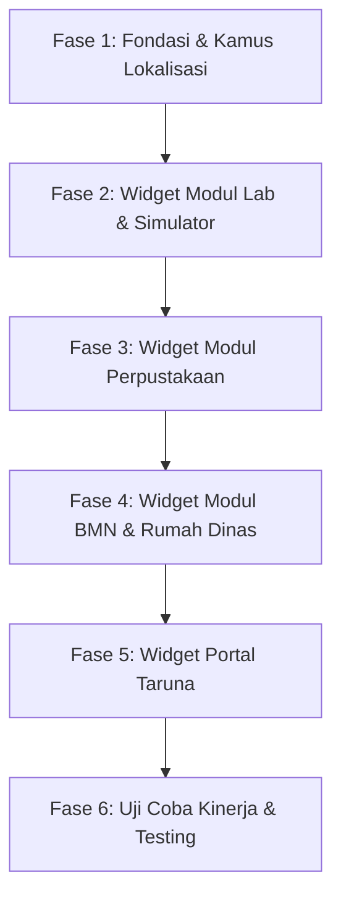

# Rencana Aksi Pengembangan Widget Dashboard (Chart & Table) SILT-STIP

Dokumen ini berisi analisis kebutuhan, katalog spesifikasi, arsitektur teknis, matriks hak akses, dan rencana aksi implementasi widget dashboard bertipe **Chart (Grafik)** dan **Table (Tabel Interaktif)** untuk Sistem Informasi Layanan Terpadu (SILT-STIP) Sekolah Tinggi Ilmu Pelayaran Jakarta, mengacu pada dokumen rujukan `PRD_STIP_Terpadu.md` (§8, §2, §3, §4, §5, §6, §7).

> [!NOTE]
> **Status Dokumen**: **Selesai Dieksekusi (Completed)**.  
> Seluruh widget tipe Chart dan Table pada Admin & Student Panel beserta data dummy seeder dan pengujian Feature Test telah berhasil diimplementasikan secara penuh.

---

## 1. Analisis Kebutuhan & Tujuan

Berdasarkan `PRD_STIP_Terpadu.md`, aplikasi menyatukan 4 modul utama (Lab/Simulator SPP, BMN, Rumah Dinas, dan Perpustakaan) dengan 2 panel Filament (`admin` dan `student`) serta beragam aktor pemangku kepentingan.

### 1.1 Masalah pada Dashboard Saat Ini
Saat ini dashboard Filament baru memiliki 2 widget metrik sederhana tipe kartu ringkasan:
- `App\Filament\Admin\Widgets\AdminStatsOverview` (hanya angka total booking, BMN, pinjaman buku, dan SIP).
- `App\Filament\Student\Widgets\StudentStatsOverview` (hanya angka pinjaman dan denda pribadi taruna).

### 1.2 Urgensi Penambahan Widget Chart & Table
1. **Pimpinan (`leader`)**: Membutuhkan visualisasi tren utilisasi lab (jam operasional vs jam terpakai), kepatuhan standar IMO, rekap kondisi BMN, dan tingkat hunian rumah dinas secara cepat untuk pengambilan keputusan.
2. **Petugas Operasional (`officer`)**: Memerlukan tabel aksi cepat (antrean verifikasi booking lab, pengajuan BMN, sirkulasi buku hari ini, dan stok bahan yang menipis) langsung di dashboard tanpa harus berpindah-pindah menu resource.
3. **Admin Unit Kerja (`unit_admin`)**: Memerlukan visibilitas inventaris dan pengajuan barang milik unitnya sendiri.
4. **Dosen (`teacher`)**: Memerlukan tabel jadwal mengajar simulator harian dan status bahan praktik.
5. **Taruna (`student`)**: Memerlukan kejelasan jadwal sesi praktikum yang diikuti serta peringatan jatuh tempo pinjaman buku.

---

## 2. Katalog Lengkap Widget Dashboard

Berikut adalah daftar seluruh widget bertipe **Chart** dan **Table** yang diidentifikasi dari PRD:

```
Total Widget yang Dirancang: 20 Widget
├── Modul Lab / Simulator SPP : 4 Chart, 3 Table
├── Modul BMN                 : 2 Chart, 3 Table
├── Modul Rumah Dinas         : 2 Chart, 2 Table
├── Modul Perpustakaan        : 3 Chart, 3 Table
└── Portal Taruna (Student)   : 1 Chart, 2 Table
```

---

### 2.1 Modul A: Lab & Simulator SPP

#### A. WIDGET CHART (GRAFIK)

##### 1. `LabUtilizationTrendChart` (Tren Utilisasi & Jam Operasional Lab)
- **Tipe**: `ChartWidget` (`line` atau bar kombinasi)
- **Rujukan PRD**: §8 (*"Utilisasi lab %, tren, rencana vs realisasi, FR/JLH/DRS/JF/JP"*).
- **Deskripsi**: Menampilkan perbandingan jam terbooking vs kapasitas jam operasional bulanan atau mingguan, serta perbandingan jam *rencana* (`approved`) vs *realisasi* (`completed`).
- **Filter Widget**: Filter periode: *Bulan Ini*, *Triwulan Terakhir*, *Tahun Akademik Berjalan*; Filter Kategori: *Semua*, *Teknika*, *Nautika*, *KALK*.
- **Formula**: `Utilisasi (%) = (Total Jam Sesi Terlaksana / Total Jam Tersedia) * 100%`.
- **Target Pengguna**: Pimpinan (Kepala Unit SPP, Ketua STIP), Petugas SPP.
- **Ukuran Layout**: `col-span-full` atau `col-span-2`.

##### 2. `LabUsageByCategoryChart` (Distribusi Penggunaan Lab per Kategori/Prodi)
- **Tipe**: `ChartWidget` (`doughnut`)
- **Rujukan PRD**: §8 (*"per kategori Teknika/Nautika/KALK"*).
- **Deskripsi**: Proporsi alokasi jam praktikum pada 8 lab aktif:
  - *Teknika*: EEL, EWS, MEL, ERCS, ACSL.
  - *Nautika*: CHL.
  - *Umum/Multi*: CBT, LTL.
- **Target Pengguna**: Kepala Unit SPP, Pimpinan Jurusan.
- **Ukuran Layout**: `col-span-1`.

##### 3. `TopSubjectsLabUsageChart` (Top 5 Mata Kuliah Pengguna Lab Terbanyak)
- **Tipe**: `ChartWidget` (`bar` horizontal)
- **Rujukan PRD**: §8 (*"mata kuliah teratas"*).
- **Deskripsi**: Menampilkan 5–10 mata kuliah dengan akumulasi jam sesi lab tertinggi dalam semester/tahun berjalan.
- **Target Pengguna**: Kepala Unit SPP, Dosen, Kaprodi.
- **Ukuran Layout**: `col-span-1`.

##### 4. `ImoCompetenceCoverageChart` (Cakupan Standar IMO Model Course)
- **Tipe**: `ChartWidget` (`bar` atau `radar`)
- **Rujukan PRD**: §8 (*"cakupan IMO, 100% booking disetujui punya mata kuliah + >=1 kompetensi IMO"*).
- **Deskripsi**: Menampilkan frekuensi pemenuhan silabus standar IMO Model Course (mis. 7.04, 7.03, 7.01, 7.08, 2.07, 1.27, 3.17) dalam pelaksanaan praktikum.
- **Target Pengguna**: Kepala Unit SPP, Auditor Mutu STCW/IMO.
- **Ukuran Layout**: `col-span-1`.

#### B. WIDGET TABLE (TABEL INTERAKTIF)

##### 1. `TodayLabScheduleTable` (Jadwal Operasional Sesi Lab Hari Ini)
- **Tipe**: `TableWidget`
- **Rujukan PRD**: §8 (*"jadwal per lab (harian)"*), §3.2 (*"check-in, check-out, catat realisasi"*).
- **Deskripsi**: Daftar real-time sesi lab yang dijadwalkan pada hari ini.
- **Kolom Tabel**:
  - Jam Sesi (`start_at` – `end_at`)
  - Nama Ruangan/Lab (`rooms.name` + `code`)
  - Mata Kuliah & Kelas (`subjects.name` + `class_group`)
  - Dosen Penanggung Jawab (`employees.name`)
  - Jumlah Peserta (Rencana / Hadir)
  - Status (`approved`, `in_use`, `completed`)
- **Aksi Cepat (Row Actions)**:
  - *Mulai Sesi / Check-in*: Mengubah status ke `in_use`.
  - *Catat Realisasi*: Membuka modal input peserta aktual, kondisi lab, dan insiden.
  - *Cetak Konfirmasi*: Unduh slip konfirmasi booking PDF.
- **Target Pengguna**: Petugas Lab (PLP), Dosen Pengampu.
- **Ukuran Layout**: `col-span-full`.

##### 2. `PendingLabBookingsTable` (Antrean Verifikasi & Persetujuan Booking)
- **Tipe**: `TableWidget`
- **Rujukan PRD**: §7.1 (*"draft -> submitted -> verified -> approved"*), §3.3 (*"SLA Petugas 1 hari kerja, Kepala Unit 1 hari kerja"*).
- **Deskripsi**: Menampilkan permohonan booking yang menunggu verifikasi Petugas (`submitted`) atau menunggu persetujuan Kepala Unit SPP (`verified`).
- **Kolom Tabel**:
  - Nomor Booking
  - Pemohon & Tanggal Pengajuan
  - Lab / Simulator Diminta
  - Jadwal Sesi yang Diajukan
  - Sisa SLA Waktu Tunggu (dengan badge warna: Hijau >12 jam, Kuning <6 jam, Merah <2 jam)
  - Tahapan Status (`Menunggu Verifikasi Petugas` / `Menunggu Persetujuan Ka. SPP`)
- **Aksi Cepat**:
  - *Verifikasi / Review*: Membuka formulir verifikasi ketersediaan bahan & kapasitas.
  - *Setujui (Approval Ka. SPP)*: Langsung mengeksekusi `lab.approve`.
  - *Tolak / Minta Revisi*: Menampilkan modal alasan penolakan/revisi wajib.
- **Target Pengguna**: Petugas SPP (`lab.verify`), Kepala Unit SPP (`lab.approve`).
- **Ukuran Layout**: `col-span-full`.

##### 3. `LowStockMaterialsTable` (Peringatan Stok Bahan Praktik Kritis)
- **Tipe**: `TableWidget`
- **Rujukan PRD**: §3.2 (*"Kekurangan stok ditandai tetapi tidak memblokir"*), §9.4 (`materials.stock_qty <= materials.min_stock`).
- **Deskripsi**: Menampilkan bahan lab consumable/alat yang stoknya menyentuh atau di bawah batas minimum pemakaian.
- **Kolom Tabel**:
  - Nama Bahan & Kode
  - Lokasi Ruangan / Lab
  - Sisa Stok Saat Ini
  - Batas Minimum Stok
  - Satuan Unit
  - Status Peringatan (Badge: Merah = Habis 0, Kuning = Di bawah batas)
- **Target Pengguna**: Petugas Lab (PLP).
- **Ukuran Layout**: `col-span-1` atau `col-span-2`.

---

### 2.2 Modul B: BMN (Barang Milik Negara)

#### A. WIDGET CHART (GRAFIK)

##### 1. `BmnConditionDistributionChart` (Distribusi Kondisi Fisik BMN)
- **Tipe**: `ChartWidget` (`doughnut` atau `pie`)
- **Rujukan PRD**: §8 (*"barang rusak"*) & §9.1 (*Enum ItemCondition: good, minor_damage, major_damage, lost*).
- **Deskripsi**: Menampilkan persentase proporsi aset kampus berdasarkan kondisi fisik: Baik, Rusak Ringan, Rusak Berat, dan Hilang.
- **Target Pengguna**: Pimpinan BMN, Petugas BMN, Kepala Unit.
- **Ukuran Layout**: `col-span-1`.

##### 2. `BmnPerUnitChart` (Distribusi Aset BMN per Unit Kerja / Jurusan)
- **Tipe**: `ChartWidget` (`bar`)
- **Rujukan PRD**: §8 (*"Total BMN, per unit dan ruangan"*).
- **Deskripsi**: Menampilkan perbandingan jumlah kuantitas aset BMN yang tersebar di masing-masing unit kerja (Nautika, Teknika, KALK, Tata Usaha, Perpustakaan, Rumah Tangga).
- **Target Pengguna**: Pimpinan BMN, Admin Sistem.
- **Ukuran Layout**: `col-span-1` atau `col-span-2`.

#### B. WIDGET TABLE (TABEL INTERAKTIF)

##### 1. `PendingBmnSubmissionsTable` (Antrean Pengajuan BMN Baru & Pengembalian)
- **Tipe**: `TableWidget`
- **Rujukan PRD**: §4.1, §4.2, §8 (*"pengajuan menunggu pemeriksaan (baru dan pengembalian)"*).
- **Deskripsi**: Menampilkan pengajuan BMN baru (`bmn_submissions`) dan pengembalian BMN (`bmn_returns`) dengan status `submitted`.
- **Kolom Tabel**:
  - Tanggal Pengajuan
  - Jenis (Badge: *BMN Baru* / *Pengembalian*)
  - Unit Pengusul & Nama Pengaju
  - Nama Barang & Kuantitas
  - Kondisi Barang
  - Bukti / Foto Kerusakan (jika rusak)
- **Aksi Cepat**:
  - *Periksa Kelengkapan*: Buka verifikasi.
  - *Setujui & Buat Rekap*: Memasukkan ke `bmn_items` dan catat perpindahan.
  - *Minta Revisi*: Kembalikan dengan catatan perbaikan.
- **Target Pengguna**: Petugas BMN (`bmn.process`).
- **Ukuran Layout**: `col-span-full`.

##### 2. `DamagedBmnItemsTable` (Daftar Aset BMN Rusak Memerlukan Tindak Lanjut)
- **Tipe**: `TableWidget`
- **Rujukan PRD**: §4.2, §8 (*"barang rusak, daftar rusak"*).
- **Deskripsi**: Inventaris BMN aktif atau yang baru dikembalikan dengan kondisi `minor_damage` atau `major_damage`.
- **Kolom Tabel**:
  - Kode BMN / NUP
  - Nama Barang, Merk, Tipe
  - Unit Kerja & Ruangan Terakhir
  - Kondisi Fisik
  - Catatan Kerusakan (`damage_note`)
  - Rekomendasi Tindakan (Perbaikan / Usul Penghapusan)
- **Target Pengguna**: Petugas BMN, Pimpinan BMN.
- **Ukuran Layout**: `col-span-full`.

##### 3. `BmnPendingDecreeDocumentsTable` (Antrean Dokumen Penetapan BMN Siap Cetak)
- **Tipe**: `TableWidget`
- **Rujukan PRD**: §4.1 (*"BMN yang perlu dokumen penetapan (mis. laptop): aplikasi membuat dokumen siap cetak"*), §8 (*"dokumen perlu dicetak"*).
- **Deskripsi**: Daftar barang BMN yang telah diverifikasi dan memiliki atribut `requires_decree = true` namun dokumen penetapannya belum dicetak atau baru dibuat.
- **Kolom Tabel**:
  - Kode Barang & Nama BMN
  - Unit & Pegawai Penanggung Jawab
  - Tanggal Penetapan
  - Status Dokumen (Belum Dicetak / Sudah Dicetak x kali)
- **Aksi Cepat**:
  - *Cetak Surat Penetapan*: Direct download / render PDF penetapan.
- **Target Pengguna**: Admin Unit Kerja, Petugas BMN.
- **Ukuran Layout**: `col-span-1` atau `col-span-2`.

---

### 2.3 Modul C: Surat Izin Rumah Dinas

#### A. WIDGET CHART (GRAFIK)

##### 1. `ResidenceOccupancyChart` (Tingkat Okupansi Rumah Dinas)
- **Tipe**: `ChartWidget` (`doughnut`)
- **Rujukan PRD**: §8 (*"Jumlah pengajuan dan statusnya"*), §9.4 (`official_residences`).
- **Deskripsi**: Perbandingan jumlah rumah dinas yang:
  - *Terisi/Dihuni* (memiliki izin huni aktif).
  - *Kosong/Tersedia* (aktif dan belum ada penghuni).
  - *Tidak Siap Huni/Renovasi* (`is_active = false`).
- **Target Pengguna**: Pimpinan (Ketua STIP), Petugas Rumah Tangga.
- **Ukuran Layout**: `col-span-1`.

##### 2. `ResidencePermitStatusChart` (Statistik Pengajuan SIP per Status)
- **Tipe**: `ChartWidget` (`bar`)
- **Rujukan PRD**: §5, §8.
- **Deskripsi**: Rekapitulasi permohonan SIP rumah dinas berdasarkan status alur: `submitted`, `verified`, `approved`, `rejected`.
- **Target Pengguna**: Petugas Rumah Tangga, Pimpinan.
- **Ukuran Layout**: `col-span-1`.

#### B. WIDGET TABLE (TABEL INTERAKTIF)

##### 1. `PendingResidencePermitsTable` (Antrean Persetujuan SIP Rumah Dinas)
- **Tipe**: `TableWidget`
- **Rujukan PRD**: §5 (*"Petugas Rumah Tangga memeriksa -> Ketua STIP menyetujui -> surat izin terbit"*).
- **Deskripsi**: Permohonan izin rumah dinas yang menunggu verifikasi Petugas RT (`submitted`) atau menunggu persetujuan final Ketua STIP (`verified`).
- **Kolom Tabel**:
  - Nomor Pengajuan / Draft SIP
  - Pegawai Calon Penghuni & NIP
  - Unit Pengusul
  - Alamat & Nomor Rumah Dinas Diminta
  - Rencana Periode Huni
  - Tahapan Alur Saat Ini
- **Aksi Cepat**:
  - *Verifikasi Kelengkapan*: (Role: Petugas RT).
  - *Tanda Tangan / Setujui*: (Role: Ketua STIP -> menerbitkan nomor izin resmi).
  - *Cetak Surat Izin*: Hanya aktif jika status sudah `approved`.
- **Target Pengguna**: Petugas Rumah Tangga (`residence.process`), Ketua STIP (`residence.approve`).
- **Ukuran Layout**: `col-span-full`.

##### 2. `ExpiringResidencePermitsTable` (Daftar Izin Penghuni Mendekati Berakhir)
- **Tipe**: `TableWidget`
- **Rujukan PRD**: §5, §8 (*"Rekap per periode dan status"*).
- **Deskripsi**: Menampilkan penghuni rumah dinas yang masa berlakunya berakhir dalam 30–60 hari ke depan untuk pemantauan perpanjangan atau penyerahan kembali kunci.
- **Kolom Tabel**:
  - Nomor SIP
  - Nama Pegawai Penghuni
  - Nomor Rumah Dinas
  - Tanggal Akhir Hunian (`occupancy_end`)
  - Sisa Hari Masa Huni (Badge Kuning/Merah)
- **Target Pengguna**: Petugas Rumah Tangga, Pimpinan.
- **Ukuran Layout**: `col-span-full` atau `col-span-2`.

---

### 2.4 Modul D: Perpustakaan

#### A. WIDGET CHART (GRAFIK)

##### 1. `LibraryCirculationTrendChart` (Tren Peminjaman & Pengembalian Buku Bulanan)
- **Tipe**: `ChartWidget` (`line` multi-dataset)
- **Rujukan PRD**: §8 (*"Riwayat pinjam/kembali (filter tanggal)"*).
- **Deskripsi**: Grafik garis bulanan yang membandingkan tren jumlah buku dipinjam vs buku dikembalikan.
- **Target Pengguna**: Kepala Perpustakaan, Petugas Perpustakaan.
- **Ukuran Layout**: `col-span-2`.

##### 2. `TopBorrowedBooksChart` (Top 5 Buku Terpopuler / Paling Banyak Dipinjam)
- **Tipe**: `ChartWidget` (`bar` horizontal)
- **Rujukan PRD**: §8 (*"5 buku terpopuler"*).
- **Deskripsi**: Menampilkan 5 buku dengan frekuensi transaksi sirkulasi terbanyak.
- **Target Pengguna**: Kepala Perpustakaan, Petugas Perpustakaan, Taruna & Dosen.
- **Ukuran Layout**: `col-span-1`.

##### 3. `BooksByCategoryChart` (Komposisi Koleksi Buku Berdasarkan Kategori)
- **Tipe**: `ChartWidget` (`pie`)
- **Rujukan PRD**: §8 (*"Total koleksi (judul, stok)"*).
- **Deskripsi**: Proporsi jumlah judul dan stok buku per kategori keilmuan (Nautika, Teknika, Ketatalaksanaan/KALK, Bahasa Inggris Maritim, Umum).
- **Target Pengguna**: Pengelola Perpustakaan.
- **Ukuran Layout**: `col-span-1`.

#### B. WIDGET TABLE (TABEL INTERAKTIF)

##### 1. `OverdueCirculationsTable` (Peminjaman Jatuh Tempo & Menunggak Denda)
- **Tipe**: `TableWidget`
- **Rujukan PRD**: §6.2, §6.3, §8 (*"jatuh tempo/terlambat, denda Rp 1.000 / hari / buku, blokir peminjam"*).
- **Deskripsi**: Menampilkan sirkulasi buku yang telah melewati `due_date` dan belum dikembalikan.
- **Kolom Tabel**:
  - Kode Transaksi
  - Nama Peminjam & Nomor Induk (NIT / NIP)
  - Tipe Peminjam (Taruna / Dosen / Pegawai)
  - Judul Buku Dipinjam
  - Tanggal Jatuh Tempo
  - Hari Terlambat (`late_days`)
  - Akumulasi Denda (Rp 1.000 × hari)
- **Aksi Cepat**:
  - *Proses Kembali*: Membuka modal konfirmasi pengembalian dan pelunasan denda.
  - *Kirim Pengingat Notifikasi*: Trigger notifikasi database / email ke peminjam.
- **Target Pengguna**: Petugas Perpustakaan (`library.process`).
- **Ukuran Layout**: `col-span-full`.

##### 2. `TodayLibraryCirculationsTable` (Aktivitas Sirkulasi Loket Hari Ini)
- **Tipe**: `TableWidget`
- **Rujukan PRD**: §8 (*"dipinjam hari ini, sirkulasi buku cepat < 1 menit"*).
- **Deskripsi**: Log aktivitas peminjaman dan pengembalian buku di loket perpustakaan pada hari ini.
- **Kolom Tabel**:
  - Waktu Transaksi
  - Tipe Aksi (Badge Hijau: Pinjam, Badge Biru: Kembali)
  - Identitas Peminjam
  - Judul Buku
  - Batas Jatuh Tempo / Kondisi Saat Kembali
  - Petugas Loket (`loaned_by` / `returned_by`)
- **Target Pengguna**: Petugas Perpustakaan.
- **Ukuran Layout**: `col-span-full`.

##### 3. `LowStockBooksTable` (Katalog Buku Ketersediaan Habis / Kritis)
- **Tipe**: `TableWidget`
- **Rujukan PRD**: §6.3 (*"0 <= available_stock <= total_stock, Pinjam diblokir bila available_stock = 0"*).
- **Deskripsi**: Menampilkan judul-judul buku yang stok tersedianya habis (`available_stock = 0`) atau tinggal 1 eksamplar sementara peminatnya tinggi.
- **Kolom Tabel**:
  - Kode Buku & ISBN
  - Judul Buku & Pengarang
  - Kategori & Rak
  - Total Stok Koleksi
  - Stok Tersedia
- **Target Pengguna**: Petugas Perpustakaan.
- **Ukuran Layout**: `col-span-1` atau `col-span-2`.

---

### 2.5 Portal Khusus Taruna (`Student Panel`)

Sesuai PRD §2.1 & §2.3, Taruna login di panel terpisah (`/student`) dengan akses terbatas pada kegiatan belajar mandiri lab dan peminjaman buku perpustakaan.

#### A. WIDGET CHART (GRAFIK)

##### 1. `StudentMonthlyStudyActivityChart` (Aktivitas Latihan Mandiri & Pustaka Taruna)
- **Tipe**: `ChartWidget` (`bar`)
- **Deskripsi**: Grafik jam praktik simulator mandiri dan jumlah peminjaman buku taruna per bulan dalam semester berjalan.
- **Target Pengguna**: Taruna (Student).
- **Ukuran Layout**: `col-span-1`.

#### B. WIDGET TABLE (TABEL INTERAKTIF)

##### 1. `StudentUpcomingLabSessionsTable` (Jadwal Praktikum Lab / Simulator Taruna)
- **Tipe**: `TableWidget`
- **Rujukan PRD**: §2.3, §3.
- **Deskripsi**: Daftar jadwal sesi praktikum yang akan diikuti taruna (sesuai kelas/mata kuliahnya) serta booking mandiri ERCS/CBT miliknya yang sudah disetujui.
- **Kolom Tabel**:
  - Tanggal & Jam Sesi
  - Nama Lab / Simulator
  - Mata Kuliah / Kompetensi IMO
  - Dosen Pengampu / Instruktur
  - Status Sesi
- **Target Pengguna**: Taruna.
- **Ukuran Layout**: `col-span-full`.

##### 2. `StudentActiveLoansTable` (Buku Sedang Dipinjam & Status Jatuh Tempo)
- **Tipe**: `TableWidget`
- **Rujukan PRD**: §6.3 (*"Kuota 3 buku (taruna), masa pinjam 7 hari"*).
- **Deskripsi**: Daftar buku yang sedang dipinjam oleh taruna yang bersangkutan beserta hitung mundur batas jatuh tempo dan peringatan denda.
- **Kolom Tabel**:
  - Judul Buku & Pengarang
  - Tanggal Peminjaman
  - Tanggal Jatuh Tempo
  - Sisa Hari Pinjam / Status Keterlambatan (Badge Hijau/Kuning/Merah)
  - Estimasi Denda (jika lewat tanggal)
- **Target Pengguna**: Taruna.
- **Ukuran Layout**: `col-span-full`.

---

## 3. Matriks Hak Akses & Penempatan Widget per Peran (RBAC)

Filament widget mengimplementasikan method `canView(): bool` untuk mengontrol visibilitas berdasarkan otorisasi peran Spatie (`roles`) dan izin per modul (`permissions`):

| Kode Widget | Tipe | Admin Sistem (`admin`) | Pimpinan (`leader`) | Petugas SPP (`officer:lab`) | Petugas BMN (`officer:bmn`) | Petugas RT (`officer:residence`) | Petugas Perpus (`officer:library`) | Admin Unit (`unit_admin`) | Dosen (`teacher`) | Taruna (`student`) |
|---|:---:|:---:|:---:|:---:|:---:|:---:|:---:|:---:|:---:|:---:|
| `AdminStatsOverview` | Metrik | ✅ | ✅ | ✅ | ✅ | ✅ | ✅ | ✅ | ✅ | ❌ |
| `LabUtilizationTrendChart` | Chart | ✅ | ✅ | ✅ | ❌ | ❌ | ❌ | ❌ | 👁 (prodi) | ❌ |
| `LabUsageByCategoryChart` | Chart | ✅ | ✅ | ✅ | ❌ | ❌ | ❌ | ❌ | ❌ | ❌ |
| `TopSubjectsLabUsageChart` | Chart | ✅ | ✅ | ✅ | ❌ | ❌ | ❌ | ❌ | 👁 (prodi) | ❌ |
| `ImoCompetenceCoverageChart` | Chart | ✅ | ✅ | ✅ | ❌ | ❌ | ❌ | ❌ | ❌ | ❌ |
| `TodayLabScheduleTable` | Table | ✅ | 👁 | ✅ (Aksi) | ❌ | ❌ | ❌ | ❌ | ✅ (Ajar) | ❌ |
| `PendingLabBookingsTable` | Table | 👁 (Read) | ✅ (Tahap 2) | ✅ (Tahap 1) | ❌ | ❌ | ❌ | ❌ | ❌ | ❌ |
| `LowStockMaterialsTable` | Table | ✅ | 👁 | ✅ | ❌ | ❌ | ❌ | ❌ | ❌ | ❌ |
| `BmnConditionDistributionChart`| Chart | ✅ | ✅ | ❌ | ✅ | ❌ | ❌ | 🔸 (Unit) | ❌ | ❌ |
| `BmnPerUnitChart` | Chart | ✅ | ✅ | ❌ | ✅ | ❌ | ❌ | ❌ | ❌ | ❌ |
| `PendingBmnSubmissionsTable` | Table | 👁 (Read) | 👁 | ❌ | ✅ (Proses) | ❌ | ❌ | 🔸 (Unit) | ❌ | ❌ |
| `DamagedBmnItemsTable` | Table | ✅ | 👁 | ❌ | ✅ | ❌ | ❌ | 🔸 (Unit) | ❌ | ❌ |
| `BmnPendingDecreeDocumentsTable`| Table | ✅ | 👁 | ❌ | ✅ | ❌ | ❌ | 🔸 (Unit) | ❌ | ❌ |
| `ResidenceOccupancyChart` | Chart | ✅ | ✅ | ❌ | ❌ | ✅ | ❌ | ❌ | ❌ | ❌ |
| `ResidencePermitStatusChart` | Chart | ✅ | ✅ | ❌ | ❌ | ✅ | ❌ | ❌ | ❌ | ❌ |
| `PendingResidencePermitsTable` | Table | 👁 (Read) | ✅ (Ketua) | ❌ | ❌ | ✅ (Tahap 1) | ❌ | 🔸 (Unit) | ❌ | ❌ |
| `ExpiringResidencePermitsTable` | Table | ✅ | ✅ | ❌ | ❌ | ✅ | ❌ | ❌ | ❌ | ❌ |
| `LibraryCirculationTrendChart` | Chart | ✅ | ✅ | ❌ | ❌ | ❌ | ✅ | ❌ | ❌ | ❌ |
| `TopBorrowedBooksChart` | Chart | ✅ | ✅ | ❌ | ❌ | ❌ | ✅ | ❌ | ✅ | ❌ |
| `BooksByCategoryChart` | Chart | ✅ | ✅ | ❌ | ❌ | ❌ | ✅ | ❌ | ❌ | ❌ |
| `OverdueCirculationsTable` | Table | ✅ | 👁 | ❌ | ❌ | ❌ | ✅ (Proses) | ❌ | ❌ | ❌ |
| `TodayLibraryCirculationsTable` | Table | ✅ | 👁 | ❌ | ❌ | ❌ | ✅ | ❌ | ❌ | ❌ |
| `LowStockBooksTable` | Table | ✅ | 👁 | ❌ | ❌ | ❌ | ✅ | ❌ | ❌ | ❌ |
| `StudentStatsOverview` | Metrik | ❌ | ❌ | ❌ | ❌ | ❌ | ❌ | ❌ | ❌ | ✅ |
| `StudentMonthlyStudyActivityChart`| Chart| ❌ | ❌ | ❌ | ❌ | ❌ | ❌ | ❌ | ❌ | ✅ |
| `StudentUpcomingLabSessionsTable`| Table | ❌ | ❌ | ❌ | ❌ | ❌ | ❌ | ❌ | ❌ | ✅ |
| `StudentActiveLoansTable` | Table | ❌ | ❌ | ❌ | ❌ | ❌ | ❌ | ❌ | ❌ | ✅ |

*Keterangan:*  
- ✅ = Akses penuh / dapat berinteraksi  
- 👁 = Hanya melihat (read-only)  
- 🔸 = Dibatasi hanya data milik unit kerja yang bersangkutan (Global Scope / Query Scope Unit)  
- ❌ = Widget disembunyikan otomatis oleh Filament

---

## 4. Arsitektur Teknis & Standar Kode

### 4.1 Struktur Direktori Widget
Widget akan ditempatkan rapi per modul dan panel:

```
app/Filament/
├── Admin/
│   └── Widgets/
│       ├── AdminStatsOverview.php                   # [Existing]
│       ├── Lab/
│       │   ├── LabUtilizationTrendChart.php         # Chart
│       │   ├── LabUsageByCategoryChart.php          # Chart
│       │   ├── TopSubjectsLabUsageChart.php         # Chart
│       │   ├── ImoCompetenceCoverageChart.php       # Chart
│       │   ├── TodayLabScheduleTable.php            # Table
│       │   ├── PendingLabBookingsTable.php          # Table
│       │   └── LowStockMaterialsTable.php           # Table
│       ├── Bmn/
│       │   ├── BmnConditionDistributionChart.php    # Chart
│       │   ├── BmnPerUnitChart.php                  # Chart
│       │   ├── PendingBmnSubmissionsTable.php       # Table
│       │   ├── DamagedBmnItemsTable.php             # Table
│       │   └── BmnPendingDecreeDocumentsTable.php   # Table
│       ├── Residence/
│       │   ├── ResidenceOccupancyChart.php          # Chart
│       │   ├── ResidencePermitStatusChart.php       # Chart
│       │   ├── PendingResidencePermitsTable.php     # Table
│       │   └── ExpiringResidencePermitsTable.php    # Table
│       └── Library/
│           ├── LibraryCirculationTrendChart.php     # Chart
│           ├── TopBorrowedBooksChart.php            # Chart
│           ├── BooksByCategoryChart.php             # Chart
│           ├── OverdueCirculationsTable.php         # Table
│           ├── TodayLibraryCirculationsTable.php    # Table
│           └── LowStockBooksTable.php               # Table
└── Student/
    └── Widgets/
        ├── StudentStatsOverview.php                 # [Existing]
        ├── StudentMonthlyStudyActivityChart.php     # Chart
        ├── StudentUpcomingLabSessionsTable.php      # Table
        └── StudentActiveLoansTable.php              # Table
```

### 4.2 Standar Chart Filament (ChartJS) & Palet Warna STIP
Filament menggunakan pustaka bawaan Chart.js. Desain widget harus menggunakan palet warna maritim yang harmonis dan konsisten:
- **Navy Primary (`#1e3a8a` / `#0284c7`)**: Untuk metrik umum, jam sesi, dan booking.
- **Emerald Success (`#059669`)**: Untuk sesi selesai (`completed`), kondisi baik (`good`), dan pengembalian tepat waktu.
- **Amber Warning (`#d97706`)**: Untuk antrean verifikasi (`submitted`), batas minimum stok, dan rusak ringan (`minor_damage`).
- **Rose / Red Danger (`#dc2626`)**: Untuk booking ditolak/batal, buku terlambat, tunggakan denda, dan rusak berat (`major_damage`).
- **Indigo / Purple (`#6366f1`)**: Untuk kompetensi IMO dan kategori keilmuan.

Contoh struktur Chart Widget:
```php
namespace App\Filament\Admin\Widgets\Lab;

use Filament\Widgets\ChartWidget;
use App\Models\Lab\Booking;

class LabUtilizationTrendChart extends ChartWidget
{
    protected static ?string $heading = 'Tren Utilisasi Lab & Simulator';
    protected static ?int $sort = 2;
    protected int | string | array $columnSpan = 'full';

    public ?string $filter = '3_months';

    protected function getFilters(): ?array
    {
        return [
            'this_month' => __('filament.widgets.filters.this_month'),
            '3_months'   => __('filament.widgets.filters.3_months'),
            'this_year'  => __('filament.widgets.filters.this_year'),
        ];
    }

    protected function getData(): array
    {
        // Agregasi bulanan menggunakan query builder teroptimasi
        return [
            'datasets' => [
                [
                    'label' => 'Jam Terbooking (Rencana)',
                    'data'  => [120, 145, 160],
                    'borderColor' => '#0284c7',
                ],
                [
                    'label' => 'Jam Realisasi Aktual',
                    'data'  => [110, 138, 152],
                    'borderColor' => '#059669',
                ],
            ],
            'labels' => ['Agustus', 'September', 'Oktober'],
        ];
    }

    protected function getType(): string
    {
        return 'line';
    }

    public static function canView(): bool
    {
        return auth()->user()?->hasAnyRole(['admin', 'leader', 'officer']) ?? false;
    }
}
```

### 4.3 Standar Table Widget Filament
Setiap Table Widget menggunakan query Eloquent yang efisien (dengan eager loading relasi untuk mencegah N+1):
- Menghindari `Model::all()`
- Menggunakan `query()->with(['room', 'subject', 'responsibleLecturer'])`
- Mengatur `$defaultPaginationPageOption = 5` agar dashboard tetap ringkas dan tidak terlalu panjang
- Menyediakan tindakan langsung (Action) dengan modal konfirmasi dan form cepat

### 4.4 Optimasi Kinerja Database
Mengacu pada PRD §10 (*"Kalender dan dashboard < 2 detik untuk 1 tahun data"*):
- Manfaatkan indeks yang sudah ada di database (`status`, `start_at`, `due_date`, `unit_id`).
- Gunakan agregasi langsung di tingkat SQL (`sum()`, `count()`, `groupByRaw("DATE_FORMAT(start_at, '%Y-%m')")`) daripada memproses koleksi PHP.
- Terapkan Polling interval adaptif (mis. `protected static ?string $pollingInterval = '60s'` untuk jadwal operasional hari ini, dan `null` untuk widget laporan statistik bulanan agar tidak membebani server).

---

## 5. Rencana Aksi Bertahap (Action Plan Steps)

Pelaksanaan implementasi dibagi menjadi 6 fase terstruktur:



### Fase 1: Fondasi, Kamus Terjemahan, & Role Scoping
1. **Tambahkan Kamus Terjemahan**:
   - Daftarkan seluruh heading, label dataset, kolom tabel, dan opsi filter di `lang/id/filament.php` dan `lang/en/filament.php` (sesuai standar dual bahasa).
2. **Siapkan Trait / Helper Scope**:
   - Trait untuk scoping data unit kerja (`HasUnitScope`) agar Admin Unit Kerja otomatis terfilter hanya pada unitnya.

### Fase 2: Implementasi Widget Modul Lab / SPP (Prioritas Tinggi)
1. Buat `TodayLabScheduleTable` (Jadwal Lab Hari Ini + Action Check-in & Realisasi).
2. Buat `PendingLabBookingsTable` (Antrean Verifikasi 2 Tahap: Petugas & Kepala Unit SPP).
3. Buat `LabUtilizationTrendChart` (Jam terbooking vs Jam operasional).
4. Buat `LabUsageByCategoryChart` (Distribusi Teknika/Nautika/KALK).
5. Buat `TopSubjectsLabUsageChart` & `ImoCompetenceCoverageChart`.
6. Buat `LowStockMaterialsTable`.

### Fase 3: Implementasi Widget Modul Perpustakaan
1. Buat `TodayLibraryCirculationsTable` (Sirkulasi Loket Hari Ini).
2. Buat `OverdueCirculationsTable` (Peminjaman Jatuh Tempo & Denda Otomatis + Aksi Kembali).
3. Buat `LibraryCirculationTrendChart` (Tren Peminjaman & Pengembalian).
4. Buat `TopBorrowedBooksChart` (5 Buku Terpopuler).
5. Buat `BooksByCategoryChart` & `LowStockBooksTable`.

### Fase 4: Implementasi Widget Modul BMN & Rumah Dinas
1. Buat `PendingBmnSubmissionsTable` (Verifikasi BMN Baru & Pengembalian).
2. Buat `DamagedBmnItemsTable` (Monitoring Barang Rusak).
3. Buat `BmnPendingDecreeDocumentsTable` (Antrean SK Penetapan Siap Cetak).
4. Buat `BmnConditionDistributionChart` & `BmnPerUnitChart`.
5. Buat `PendingResidencePermitsTable` (Verifikasi Petugas RT & Approval Ketua STIP).
6. Buat `ResidenceOccupancyChart` & `ExpiringResidencePermitsTable`.

### Fase 5: Implementasi Widget Portal Taruna (`Student Panel`)
1. Buat `StudentUpcomingLabSessionsTable` (Jadwal Sesi Simulator / Praktikum Taruna).
2. Buat `StudentActiveLoansTable` (Pinjaman Buku Aktif & Peringatan Jatuh Tempo).
3. Buat `StudentMonthlyStudyActivityChart` (Grafik Aktivitas Belajar Mandiri).

### Fase 6: Penataan Layout Dashboard, Uji Coba, & Verifikasi
1. Atur urutan sortasi (`$sort`) dan pembagian lebar kolom (`$columnSpan`) agar dashboard tampak seimbang dan estetis.
2. Pastikan filter periode dan kategori pada chart berfungsi secara dinamis tanpa me-reload seluruh halaman.
3. Tulis PHPUnit Feature Test untuk memastikan otorisasi `canView()` sesuai matriks hak akses.
4. Jalankan Laravel Pint (`vendor/bin/pint --dirty --format agent`) untuk memastikan kode mematuhi standar PSR-12 / Laravel.

---

## 6. Kriteria Penerimaan (Acceptance Criteria)

- [x] Seluruh widget baru berhasil dibuat di direktori yang sesuai tanpa error dependensi.
- [x] Widget Chart menampilkan data agregasi yang akurat dari tabel `bookings`, `bmn_items`, `official_residences`, dan `circulations`.
- [x] Filter pada Chart (Bulan ini / 3 bulan / Tahun ini) berfungsi reaktif via Livewire.
- [x] Widget Table memiliki paginasi yang cepat (<2 detik), aksi baris (modal check-in, verifikasi, approval, cetak PDF) berjalan lancar.
- [x] Pembatasan hak akses (`canView()`) 100% konsisten dengan matriks hak akses pada PRD §2.3.
- [x] Admin Unit Kerja hanya melihat data yang terafiliasi dengan unit kerjanya.
- [x] Panel Taruna (`/student`) hanya memuat widget personal milik taruna tersebut.
- [x] Seluruh teks heading, label, dan filter memiliki terjemahan lengkap di `lang/id` dan `lang/en`.
- [x] Pengujian PHPUnit lulus (29/29 tests, 202 assertions) dan kode rapi sesuai Laravel Pint.

---

## 7. Rekomendasi Alur Tindak Lanjut

Setelah dokumen rencana aksi ini disetujui:
1. Pengguna dapat memberikan konfirmasi: *"Setuju, lanjutkan eksekusi Fase 1 dan Fase 2"* (atau modul tertentu yang ingin diprioritaskan lebih dulu).
2. Eksekusi dilakukan per fase dengan pengujian langsung pada browser dan Feature Test.
