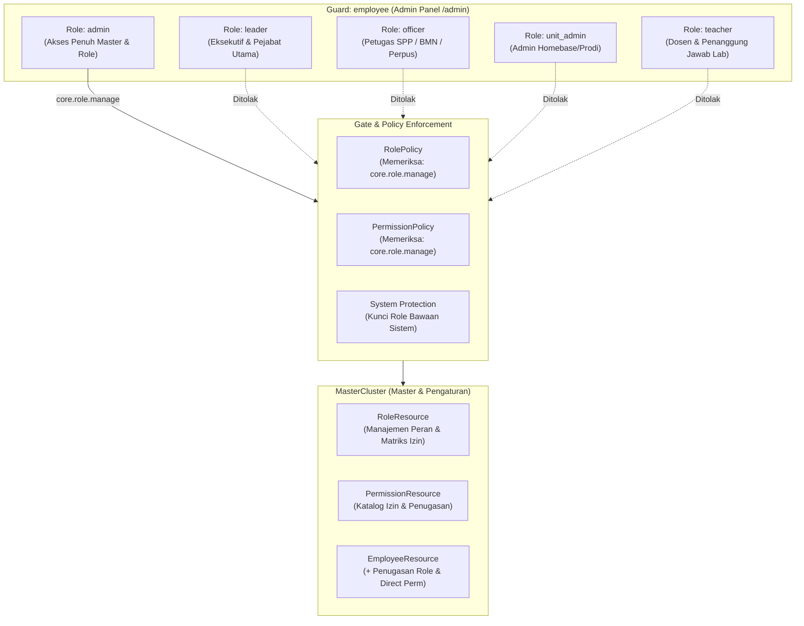

# Rencana Aksi & Review Implementasi Filament Resource: Role & Permission
## Sistem Informasi Layanan Terpadu STIP Jakarta (SILT-STIP)

Dokumen ini merupakan hasil review mendalam terhadap basis kode aktif, skema basis data, dan spesifikasi dokumen [PEMBAGIAN_AKSES_SPATIE_PERMISSION.md](file:///home/kurnia/HTDOCS/app-stip/PEMBAGIAN_AKSES_SPATIE_PERMISSION.md) serta [PRD_STIP_Terpadu.md](file:///home/kurnia/HTDOCS/app-stip/PRD_STIP_Terpadu.md). Dokumen ini memuat analisis gap, rancangan arsitektur antarmuka Filament 5, spesifikasi teknis komponen, serta rencana eksekusi bertahap untuk resource pengelola **Role** dan **Permission**.

> [!IMPORTANT]
> **Status Dokumen: REVIEW & RENCANA AKSI (Belum Dieksekusi)**
> Sesuai instruksi pengguna, perubahan kode belum diaplikasikan ke sistem. Eksekusi teknis menunggu persetujuan dan konfirmasi terhadap rancangan ini.

---

## 1. Temuan Hasil Review Basis Kode (Current State Audit)

Berdasarkan audit menyeluruh pada lingkungan aplikasi:

| Komponen | Status Saat Ini | Temuan & Analisis Gap |
|---|:---:|---|
| **Paket Spatie** | Terpasang (`8.3.0`) | Paket `spatie/laravel-permission` versi 8.3.0 terpasang dan kompatibel dengan Laravel 13 & PHP 8.4. |
| **Tabel Database** | Tersedia tapi Kosong | Tabel `roles`, `permissions`, `model_has_roles`, `role_has_permissions`, dan `model_has_permissions` sudah dimigrasi, namun **isinya masih 0 baris**. |
| **Model Employee** | Siap | [Employee.php](file:///home/kurnia/HTDOCS/app-stip/app/Models/Core/Employee.php) sudah menggunakan trait `HasRoles` dan `protected string $guard_name = 'employee';`. |
| **Seeder Role & Perms** | Ada tapi Belum Dipanggil | [RoleAndPermissionSeeder.php](file:///home/kurnia/HTDOCS/app-stip/database/seeders/RoleAndPermissionSeeder.php) sudah mendefinisikan 60 permissions dan 5 roles, namun **belum didaftarkan di `DatabaseSeeder.php`** dan belum dieksekusi ke basis data. |
| **Seeder Employee** | Belum Menugaskan Role | [EmployeeSeeder.php](file:///home/kurnia/HTDOCS/app-stip/database/seeders/EmployeeSeeder.php) membuat 10 akun pegawai tetapi **belum menugaskan role Spatie** (`assignRole`), sehingga `AuthorizationTest` saat ini gagal. |
| **Filament Admin Panel** | Belum Memiliki Resource | Direktori [app/Filament/Admin/Resources](file:///home/kurnia/HTDOCS/app-stip/app/Filament/Admin/Resources) belum memiliki `RoleResource` maupun `PermissionResource`. |
| **EmployeeResource** | Belum Ada Form Role | [EmployeeResource.php](file:///home/kurnia/HTDOCS/app-stip/app/Filament/Admin/Resources/Employees/EmployeeResource.php) belum menyediakan input pemilihan Role maupun penugasan direct permissions bagi pegawai. |
| **Policies** | Belum Ada untuk Role/Perm | Belum ada `RolePolicy.php` dan `PermissionPolicy.php` di [app/Policies/](file:///home/kurnia/HTDOCS/app-stip/app/Policies). |
| **Bahasa / Lokalisasi** | Belum Terdaftar | Kamus bahasa [lang/id/filament.php](file:///home/kurnia/HTDOCS/app-stip/lang/id/filament.php) dan [lang/en/filament.php](file:///home/kurnia/HTDOCS/app-stip/lang/en/filament.php) belum memuat terjemahan label resource Role dan Permission. |

---

## 2. Arsitektur & Prinsip Otorisasi Spatie pada Filament 5

Sesuai dokumen spesifikasi hak akses STIP Jakarta:



### 2.1 Segregasi Kewenangan & Perlindungan Keamanan (SoD)
1. **Hak Kelola Role & Permission (`core.role.manage`)**:
   - Hanya diberikan kepada Administrator Sistem (`admin`).
   - Pimpinan (`leader`), petugas operasional (`officer`), admin unit (`unit_admin`), dan dosen (`teacher`) dilarang melihat menu ini (`viewAny` = `false`).
2. **Perlindungan Role Sistem (Immutable Built-in Roles)**:
   - Lima role baku sistem: `admin`, `leader`, `officer`, `unit_admin`, `teacher`.
   - Role-role ini **dilarang dihapus (cannot be deleted)** dari UI maupun API.
   - Kolom `name` pada role `admin` terkunci agar tidak terjadi penggantian nama yang memutus akses darurat.
3. **Pencegahan Self-Lockout**:
   - Izin `core.role.manage` pada role `admin` tidak dapat dicabut melalui form UI untuk mencegah administrator terkunci di luar sistem secara permanen.
4. **Immutability Nama Permission**:
   - Nama 60 izin sistem (seperti `lab.booking.verify`, `bmn.submission.process`) terikat langsung pada logika kode aplikasi dan Policy. Oleh karena itu, pengeditan nama permission dari UI dibatasi agar integritas sistem tetap terjaga.

---

## 3. Spesifikasi Rancangan Antarmuka Filament 5

Aplikasi menggunakan **Filament v5.9**, sehingga seluruh rancangan memanfaatkan API Filament 5:
- Formulir menggunakan `Filament\Schemas\Schema` dan komponen `Filament\Forms\Components\*`.
- Tabel menggunakan `Filament\Tables\Table` dengan metode `recordActions()` dan `toolbarActions()`.
- Ikon menggunakan enum `Filament\Support\Icons\Heroicon`.

---

### 3.1 Resource 1: `RoleResource`
- **Lokasi Berkas**: `app/Filament/Admin/Resources/Roles/RoleResource.php`
- **Model**: `Spatie\Permission\Models\Role`
- **Cluster**: `App\Filament\Admin\Clusters\Master\MasterCluster`
- **Ikon Navigasi**: `Heroicon::OutlinedShieldCheck`
- **Urutan Navigasi (`navigationSort`)**: `3` (berdampingan dengan Data Pegawai di urutan 2)
- **Model Label**:
  - ID: `Peran & Hak Akses` / `Peran`
  - EN: `Role & Access Control` / `Roles`

#### Formulir (`form(Schema $schema): Schema`):
Formulir dirancang elegan dengan pembagian modul yang bersih menggunakan tabs/sections:

1. **Section Informasi Peran**:
   - `TextInput::make('name')`:
     - Label: `Nama Peran (Kode Role)`
     - Placeholder: `Mis. officer_lab, reviewer, dll.`
     - Wajib diisi, unik terhadap `guard_name = 'employee'`.
     - Dinonaktifkan (`disabled`) jika record merupakan salah satu dari 5 role sistem.
   - `TextInput::make('guard_name')`:
     - Label: `Guard Otentikasi`
     - Nilai default: `'employee'`.
     - Read-only & dehydrated.

2. **Section / Tabs Matriks Izin (Grouped Permissions Matrix)**:
   Izin dibagi menjadi 5 tab sesuai modul pada dokumen spesifikasi, masing-masing dilengkapi tombol *"Pilih Semua"* dan *"Batalkan Semua"*:
   - **Tab 1: Modul Core & Administrasi (`core.*` - 16 izin)**:
     - `core.employee.view`, `.create`, `.update`, `.delete`
     - `core.student.view`, `.create`, `.update`, `.delete`
     - `core.role.manage`, `core.unit.view`, `core.unit.manage`
     - `core.room.view`, `core.room.manage`, `core.template.manage`
     - `core.setting.manage`, `core.audit.view`
   - **Tab 2: Modul Lab & Simulator SPP (`lab.*` - 15 izin)**:
     - `lab.schedule.view`, `lab.booking.view-all`, `lab.booking.view-own`
     - `lab.booking.create`, `lab.booking.create-on-behalf`, `lab.booking.update`, `lab.booking.cancel`
     - `lab.booking.verify` (Verifikasi Tahap 1 Petugas SPP)
     - `lab.booking.approve` (Persetujuan Tahap 2 Ka. Unit SPP)
     - `lab.booking.realize` (Pencatatan realisasi sesi praktikum)
     - `lab.curriculum.manage`, `lab.material.manage`, `lab.blackout.manage`
     - `lab.document.print`, `lab.report.view`
   - **Tab 3: Modul BMN (`bmn.*` - 14 izin)**:
     - `bmn.item.view-all`, `bmn.item.view-unit`, `bmn.item.manage`
     - `bmn.submission.view-all`, `bmn.submission.view-unit`, `bmn.submission.create`
     - `bmn.submission.process` (Verifikasi fisik Petugas BMN)
     - `bmn.return.view-all`, `bmn.return.view-unit`, `bmn.return.create`
     - `bmn.return.process` (Pemeriksaan fisik pengembalian)
     - `bmn.movement.view`, `bmn.document.print`, `bmn.report.view`
   - **Tab 4: Modul Rumah Dinas (`residence.*` - 8 izin)**:
     - `residence.master.manage`, `residence.permit.view-all`, `residence.permit.view-unit`
     - `residence.permit.create`
     - `residence.permit.verify` (Pemeriksaan kelayakan Petugas Rumah Tangga)
     - `residence.permit.approve` (Persetujuan akhir Ketua STIP)
     - `residence.document.print`, `residence.report.view`
   - **Tab 5: Modul Perpustakaan (`library.*` - 7 izin)**:
     - `library.book.view`, `library.book.manage`
     - `library.circulation.view-all`, `library.circulation.view-own`
     - `library.circulation.process` (Sirkulasi loket pinjam/kembali)
     - `library.fine.confirm` (Pelunasan denda)
     - `library.report.view` (Dashboard & laporan perpus)

   > [!TIP]
   > Setiap checkbox izin akan menampilkan **Nama Teknis** (mis. `lab.booking.verify`) sekaligus **Deskripsi Fungsional Bahasa Indonesia** (mis. `Verifikasi Tahap 1 oleh Petugas SPP`) agar sangat mudah dipahami administrator.

#### Tabel (`table(Table $table): Table`):
- Kolom:
  - `TextColumn::make('name')`: Badge dengan pewarnaan semantik:
    - `admin` -> Merah / Danger
    - `leader` -> Ungu / Violet
    - `officer` -> Biru / Info
    - `unit_admin` -> Kuning / Warning
    - `teacher` -> Hijau / Success
    - Role lainnya -> Abu-abu / Gray
  - `TextColumn::make('guard_name')`: Badge netral (`employee`).
  - `TextColumn::make('permissions_count')`: Menghitung relasi `permissions` dengan format `:count izin` (Badge info).
  - `TextColumn::make('users_count')`: Menghitung relasi `users` (pegawai) dengan format `:count pegawai` (Badge success).
  - `TextColumn::make('updated_at')`: Tanggal pembaruan terakhir.
- Tindakan Baris (`recordActions`):
  - `EditAction::make()`
  - `DeleteAction::make()`: Divalidasi dan disembunyikan jika record merupakan role bawaan sistem (`admin`, `leader`, `officer`, `unit_admin`, `teacher`).
- Relasi (`RelationManagers`):
  - `EmployeesRelationManager`: Menampilkan daftar pegawai penerima peran beserta unit kerja dan status akunnya.

---

### 3.2 Resource 2: `PermissionResource`
- **Lokasi Berkas**: `app/Filament/Admin/Resources/Permissions/PermissionResource.php`
- **Model**: `Spatie\Permission\Models\Permission`
- **Cluster**: `App\Filament\Admin\Clusters\Master\MasterCluster`
- **Ikon Navigasi**: `Heroicon::OutlinedKey`
- **Urutan Navigasi (`navigationSort`)**: `4`
- **Model Label**:
  - ID: `Kamus Izin` / `Izin Akses`
  - EN: `Permission Directory` / `Permissions`

#### Tujuan Komponen:
Menyediakan visibilitas terpusat bagi Administrator Sistem untuk memantau 60 izin sistem:
- Mengetahui izin apa saja yang aktif pada aplikasi.
- Melihat peran (roles) dan pegawai mana saja yang memegang izin tertentu.
- Melakukan filter berdasarkan modul (`Core`, `Lab SPP`, `BMN`, `Rumah Dinas`, `Perpustakaan`).

#### Tabel:
- Kolom:
  - `TextColumn::make('name')`: Nama kode izin (`font-mono`).
  - `TextColumn::make('module')`: Label kategori modul yang diekstrak dari prefix nama (Badge: Core=gray, Lab=amber, BMN=blue, Rumah Dinas=teal, Perpus=emerald).
  - `TextColumn::make('description')`: Keterangan fungsional hak akses.
  - `TextColumn::make('roles.name')`: Badge daftar role yang memegang izin tersebut.
  - `TextColumn::make('guard_name')`: Badge `employee`.
- Filter:
  - `SelectFilter` kategori modul (`core`, `lab`, `bmn`, `residence`, `library`).

---

### 3.3 Pemutakhiran Resource Pegawai (`EmployeeResource`)

Pada dokumen spesifikasi Bagian 5:
- **Petugas (`officer`)**: Memiliki peran tunggal `officer`, namun izin operasionalnya dipartisi per bidang penugasan (Staf Lab hanya memegang `lab.*`, staf BMN memegang `bmn.*`, staf Perpus memegang `library.*`).
- **Pimpinan (`leader`)**: Memiliki hak approval tertentu berdasarkan jabatan (Ka. SPP memegang `lab.booking.approve`, Ketua STIP memegang `residence.permit.approve`), serta mekanisme delegasi Plh.

Oleh karena itu, [EmployeeResource.php](file:///home/kurnia/HTDOCS/app-stip/app/Filament/Admin/Resources/Employees/EmployeeResource.php) perlu dilengkapi:
1. **Field Penugasan Role**:
   ```php
   Select::make('roles')
       ->label('Peran Akun (Roles)')
       ->relationship('roles', 'name', fn ($query) => $query->where('guard_name', 'employee'))
       ->multiple()
       ->preload()
       ->searchable(),
   ```
2. **Field Penugasan Izin Langsung (Direct Permissions)**:
   ```php
   Select::make('permissions')
       ->label('Izin Khusus / Langsung (Direct Permissions)')
       ->helperText('Gunakan untuk partisi tugas petugas operasional atau delegasi persetujuan pejabat (Plh).')
       ->relationship('permissions', 'name', fn ($query) => $query->where('guard_name', 'employee'))
       ->multiple()
       ->searchable()
       ->preload(),
   ```
3. **Kolom Tabel**:
   - Menambahkan kolom `roles.name` (badge) pada daftar tabel pegawai agar peran setiap pegawai langsung terbaca tanpa membuka form edit.

---

### 3.4 Kebijakan Otorisasi Laravel (`Policies`)

Membuat dua policy baru di bawah `app/Policies/`:

#### 1. `RolePolicy.php`:
```php
namespace App\Policies;

use App\Models\Core\Employee;
use Illuminate\Contracts\Auth\Authenticatable;
use Spatie\Permission\Models\Role;

class RolePolicy
{
    public function viewAny(Authenticatable $user): bool
    {
        return $user instanceof Employee && $user->can('core.role.manage');
    }

    public function view(Authenticatable $user, Role $role): bool
    {
        return $user instanceof Employee && $user->can('core.role.manage');
    }

    public function create(Authenticatable $user): bool
    {
        return $user instanceof Employee && $user->can('core.role.manage');
    }

    public function update(Authenticatable $user, Role $role): bool
    {
        return $user instanceof Employee && $user->can('core.role.manage');
    }

    public function delete(Authenticatable $user, Role $role): bool
    {
        if (in_array($role->name, ['admin', 'leader', 'officer', 'unit_admin', 'teacher'])) {
            return false; // Mencegah penghapusan role bawaan sistem
        }

        return $user instanceof Employee && $user->can('core.role.manage');
    }
}
```

#### 2. `PermissionPolicy.php`:
```php
namespace App\Policies;

use App\Models\Core\Employee;
use Illuminate\Contracts\Auth\Authenticatable;
use Spatie\Permission\Models\Permission;

class PermissionPolicy
{
    public function viewAny(Authenticatable $user): bool
    {
        return $user instanceof Employee && $user->can('core.role.manage');
    }

    public function view(Authenticatable $user, Permission $permission): bool
    {
        return $user instanceof Employee && $user->can('core.role.manage');
    }

    public function create(Authenticatable $user): bool
    {
        return false; // Izin dikunci pada kamus kode sistem
    }

    public function update(Authenticatable $user, Permission $permission): bool
    {
        return false;
    }

    public function delete(Authenticatable $user, Permission $permission): bool
    {
        return false;
    }
}
```

---

### 3.5 Dukungan Multibahasa (`lang/id` & `lang/en`)

Menambahkan entri translasi pada kamus:

#### Pada [lang/id/filament.php](file:///home/kurnia/HTDOCS/app-stip/lang/id/filament.php):
```php
'roles' => [
    'label' => 'Peran Pengguna',
    'plural_label' => 'Peran & Hak Akses',
    'navigation_label' => 'Peran & Hak Akses',
],
'permissions' => [
    'label' => 'Izin Akses',
    'plural_label' => 'Kamus Izin Sistem',
    'navigation_label' => 'Kamus Izin Akses',
],
```

#### Pada [lang/en/filament.php](file:///home/kurnia/HTDOCS/app-stip/lang/en/filament.php):
```php
'roles' => [
    'label' => 'User Role',
    'plural_label' => 'Roles & Permissions',
    'navigation_label' => 'Roles & Permissions',
],
'permissions' => [
    'label' => 'Permission',
    'plural_label' => 'Permission Directory',
    'navigation_label' => 'Permission Directory',
],
```

---

## 4. Penyelarasan Seeder & Pemulihan Uji Otomatis

Dari audit awal, `AuthorizationTest` gagal karena database belum memiliki role dan akun seeder belum ditugaskan role. Langkah penyelarasan yang direncanakan:

1. **Pemanggilan Seeder di `DatabaseSeeder.php`**:
   Menempatkan `RoleAndPermissionSeeder::class` tepat sebelum `EmployeeSeeder::class` agar role & permission sudah siap saat employee dibuat.
2. **Penugasan Role pada `EmployeeSeeder.php`**:
   - `admin@stipjakarta.ac.id` -> `assignRole('admin')`
   - `ketua@stipjakarta.ac.id` -> `assignRole('leader')`, `givePermissionTo('residence.permit.approve')`
   - `ka.spp@stipjakarta.ac.id` -> `assignRole('leader')`, `givePermissionTo('lab.booking.approve')`
   - `petugas.spp@stipjakarta.ac.id` -> `assignRole('officer')`, `givePermissionTo(['lab.schedule.view', 'lab.booking.view-all', 'lab.booking.verify', 'lab.booking.create', 'lab.booking.create-on-behalf', 'lab.booking.update', 'lab.booking.cancel', 'lab.booking.realize', 'lab.curriculum.manage', 'lab.material.manage', 'lab.blackout.manage', 'lab.document.print', 'lab.report.view', 'core.room.manage'])`
   - `petugas.bmn@stipjakarta.ac.id` -> `assignRole('officer')`, `givePermissionTo(['bmn.item.view-all', 'bmn.item.manage', 'bmn.submission.view-all', 'bmn.submission.process', 'bmn.return.view-all', 'bmn.return.process', 'bmn.movement.view', 'bmn.document.print', 'bmn.report.view', 'residence.master.manage', 'residence.permit.view-all', 'residence.permit.verify', 'residence.document.print', 'residence.report.view'])`
   - `petugas.perpus@stipjakarta.ac.id` -> `assignRole('officer')`, `givePermissionTo(['library.book.manage', 'library.circulation.view-all', 'library.circulation.process', 'library.fine.confirm', 'library.report.view'])`
   - `admin.teknika@stipjakarta.ac.id` -> `assignRole('unit_admin')`
   - `dosen.teknika@stipjakarta.ac.id` -> `assignRole('teacher')`
   - `dosen.nautika@stipjakarta.ac.id` -> `assignRole('teacher')`
   - `joko.prasetyo@stipjakarta.ac.id` -> `assignRole('admin')`

---

## 5. Rencana Eksekusi Bertahap (Action Plan Steps)

```mermaid
gantt
    title Rencana Eksekusi Implementasi Role & Permission Filament
    dateFormat  X
    axisFormat %s
    section Fase 1: Data & Model
    Penyelarasan Seeder & Role Assignment       :active, 0, 1
    Eksekusi Seeder ke Basis Data               :1, 2
    section Fase 2: Otorisasi & Policy
    Pembuatan RolePolicy & PermissionPolicy     :2, 3
    section Fase 3: Filament Resources
    Pembuatan RoleResource (Form Tabs & Table)  :3, 5
    Pembuatan PermissionResource                :5, 6
    Pembaruan EmployeeResource (Roles & Perms)  :6, 7
    section Fase 4: Lokalisasi & QA
    Integrasi Kamus Bahasa (lang/id & lang/en)  :7, 8
    Eksekusi Uji Otomatis & Pint Formatter      :8, 9
```



### Langkah Rinci:
1. **Fase 1 (Seeder & Data)**:
   - Edit [database/seeders/DatabaseSeeder.php](file:///home/kurnia/HTDOCS/app-stip/database/seeders/DatabaseSeeder.php) untuk mendaftarkan `RoleAndPermissionSeeder`.
   - Update [database/seeders/EmployeeSeeder.php](file:///home/kurnia/HTDOCS/app-stip/database/seeders/EmployeeSeeder.php) untuk meng-assign role & direct permission pada masing-masing persona.
   - Jalankan `php artisan db:seed --class=RoleAndPermissionSeeder` dan update employee.
2. **Fase 2 (Kebijakan Otorisasi)**:
   - Buat `app/Policies/RolePolicy.php` dan `app/Policies/PermissionPolicy.php`.
3. **Fase 3 (Filament Resources)**:
   - Buat `app/Filament/Admin/Resources/Roles/RoleResource.php` beserta pages (`ListRoles`, `CreateRole`, `EditRole`).
   - Buat `app/Filament/Admin/Resources/Permissions/PermissionResource.php` beserta pages (`ListPermissions`, `ViewPermission`).
   - Modifikasi `app/Filament/Admin/Resources/Employees/EmployeeResource.php` untuk menambahkan input `roles` dan `permissions`.
4. **Fase 4 (Translasi & Formatter)**:
   - Tambahkan label translasi di `lang/id/filament.php` dan `lang/en/filament.php`.
   - Jalankan `vendor/bin/pint --format agent` untuk menjaga kerapian kode PHP 8.4.
5. **Fase 5 (Pengujian)**:
   - Jalankan `php artisan test --filter=AuthorizationTest` untuk memastikan seluruh skenario hak akses lulus 100%.

---

## 6. Pertanyaan / Keputusan Desain untuk Pengguna

Sebelum mengeksekusi rencana di atas, mohon konfirmasi untuk aspek berikut:
1. **Apakah `PermissionResource` dibuat sebagai menu tersendiri di Master Data?**
   - *Opsi A (Rekomendasi)*: Dibuat sebagai katalog tersendiri di cluster *Master & Pengaturan* berdampingan dengan RoleResource agar admin mudah melihat rekapitulasi siapa saja yang memegang izin tertentu.
   - *Opsi B*: Cukup `RoleResource` saja, pengelolaan izin dilakukan sepenuhnya di dalam formulir Role.
2. **Apakah diperbolehkan membuat Peran Baru (Custom Roles) selain 5 peran bawaan?**
   - *Rekomendasi*: Ya, form create Role diaktifkan sehingga sistem dapat mendukung peran kustom di masa depan (misal: `auditor_eksternal`), namun 5 peran baku tetap dikunci dari penghapusan.

Dokumen ini disimpan pada:
`file:///home/kurnia/HTDOCS/app-stip/RENCANA_AKSI_FILAMENT_ROLE_PERMISSION.md`
